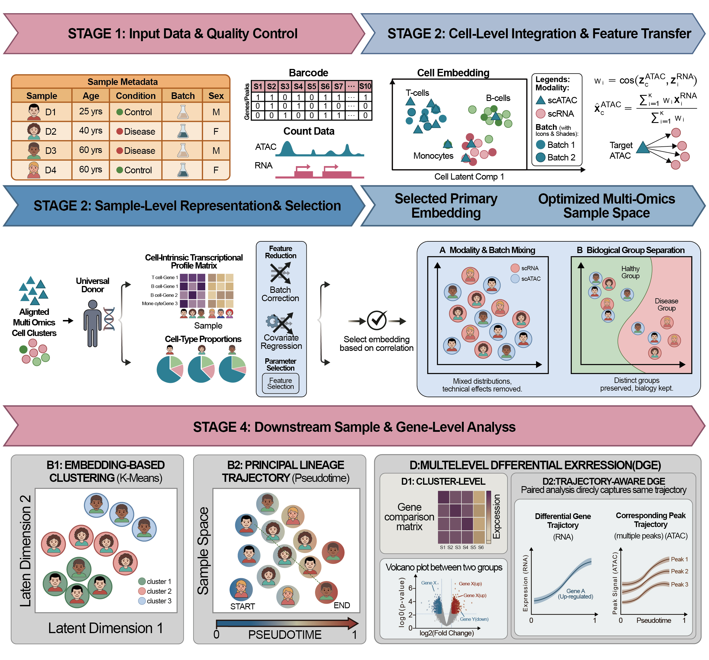

# SampleDisc: sample-level representation learning for single-cell multi-omics

<div class="hero" markdown>
SampleDisc is a config-driven Python pipeline that learns **sample-level embeddings** from scRNA-seq, scATAC-seq, or combined multi-omics data. The package supports preprocessing, cell type annotation, sample distance analysis, trajectory inference, differential analysis, and visualization in one workflow.

[Get Started](tutorials/config_guide.md){ .md-button .md-button--primary }
[Browse API](api/rna.md){ .md-button }
</div>

<div class="grid cards" markdown>

-   __Unpaired multi-omics integration__

    ---

    Integrate RNA and ATAC data from unmatched studies into a shared analytical framework.

-   __Dual sample representation__

    ---

    Learn both expression-based and cell-type-composition-based sample embeddings.

-   __Cross-study batch handling__

    ---

    Correct study effects while preserving biological structure needed for downstream analysis.

-   __End-to-end workflow__

    ---

    Move from preprocessing to trajectory and clustering through one consistent wrapper pipeline.

</div>

## Workflow overview



<div class="figure-caption">Overview of the SampleDisc workflow from preprocessing to downstream sample-level analyses.</div>

## General workflow

SampleDisc organizes analysis into four stages:

1. **Preprocessing and QC** to filter cells/features and build robust cell-level representations.
2. **Cell type assignment** through clustering or reuse of existing labels.
3. **Sample embedding** from pseudobulk expression and cell-type proportion signals.
4. **Downstream analysis** including sample distance, trajectory, differential testing, clustering, and visualization.

## Supported modes

- `scRNA-seq`
- `scATAC-seq`
- `Unpaired multi-omics (RNA + ATAC)`
- `Paired multi-omics`

## Quick start

=== "CLI"

    ```bash
    python /users/hjiang/GenoDistance/code/SampleDisc.py -m complex \
      --config /users/hjiang/GenoDistance/code/config/config_covid_rna.yaml
    ```

=== "Python"

    ```python
    import yaml
    from wrapper.wrapper import wrapper

    with open("config.yaml", "r", encoding="utf-8") as f:
        config = yaml.safe_load(f)

    wrapper(**config)
    ```
