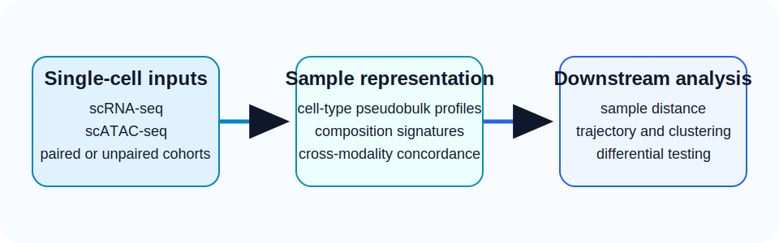

# Sample-level representation learning for single-cell multi-omics data

<div class="hero" markdown>
SampleDisc learns **sample-level embeddings** from scRNA-seq, scATAC-seq, or both, so you can compare cohorts, align trajectories, cluster samples, and test differential signals across studies.

[Get started with config-driven runs](tutorials/config_overview.md){ .md-button .md-button--primary }
[Browse the API reference](api/preparation.md){ .md-button }
</div>

<div class="grid cards" markdown>

-   __Unpaired multi-omics integration__

    ---

    Embed scRNA-seq and scATAC-seq samples into a shared space even when they come from different studies or unmatched cohorts.

-   __Dual sample representation__

    ---

    Combine pseudobulk expression signals with cell-type composition shifts to capture both intrinsic and compositional biology.

-   __Cross-study batch correction__

    ---

    Handle heterogeneous studies while preserving structure needed for trajectory inference, clustering, and cross-cohort comparisons.

-   __End-to-end workflow__

    ---

    Move from preprocessing through sample embedding and downstream analysis without leaving the same config-driven pipeline.

</div>

## Method overview

SampleDisc builds sample embeddings from three connected layers:

1. **Cell-type-resolved pseudobulk profiles** summarize expression-like signals within each sample.
2. **Cell-type composition signatures** track how the abundance of cell states changes between samples.
3. **Cross-modality concordance checks** help identify the representation that best aligns RNA and ATAC structure.



!!! note
    The current repository is primarily organized around a **config-driven CLI and wrapper pipeline**. The docs therefore show both conceptual workflow summaries and the concrete entry points currently exposed in code.

## Benchmarks at a glance

<div class="stats-grid" markdown>

<div class="stat-card">
  <div class="stat-number">4</div>
  <div class="stat-label">paired multi-omics datasets benchmarked</div>
</div>

<div class="stat-card">
  <div class="stat-number">405+</div>
  <div class="stat-label">samples across 12 studies in COVID-19 PBMC analysis</div>
</div>

<div class="stat-card">
  <div class="stat-number">0.98</div>
  <div class="stat-label">cosine similarity in cross-modality trajectory alignment</div>
</div>

<div class="stat-card">
  <div class="stat-number">82.7%</div>
  <div class="stat-label">concordance between RNA and ATAC differential signals</div>
</div>

</div>

## Supported analysis modes

- `scRNA-seq` only
- `scATAC-seq` only
- `Unpaired multi-omics` with RNA and ATAC from different samples
- `Paired multi-omics`

## Quick start

The codebase currently exposes a **config-first pipeline**. The most reliable entry point is the CLI in `code/SampleDisc.py` or a direct `wrapper(**config)` call.

=== "CLI"

    ```bash
    python /users/hjiang/GenoDistance/code/SampleDisc.py -m complex \
      --config /users/hjiang/GenoDistance/code/config/config_covid_rna.yaml
    ```

=== "Python"

    ```python
    import yaml
    from wrapper.wrapper import wrapper

    with open("config.yaml", "r", encoding="utf-8") as handle:
        config = yaml.safe_load(handle)

    wrapper(**config)
    ```

## Documentation map

- Start with [Using Config Files](tutorials/config_overview.md) if you want to run the full pipeline end to end.
- Jump to [Tutorial 1: scRNA-seq Analysis](tutorials/tutorial_rna.md) for the RNA-only workflow.
- Use [Tutorial 2: scATAC-seq Analysis](tutorials/tutorial_atac.md) for the ATAC-specific preprocessing and embedding path.
- Use [Tutorial 3: Multi-omics Integration](tutorials/tutorial_multiomics.md) for GLUE-based joint analysis.
- Browse [API Reference](api/preparation.md) for wrapper signatures and public function summaries.

## Citation

```text
[Paper citation placeholder]
```
