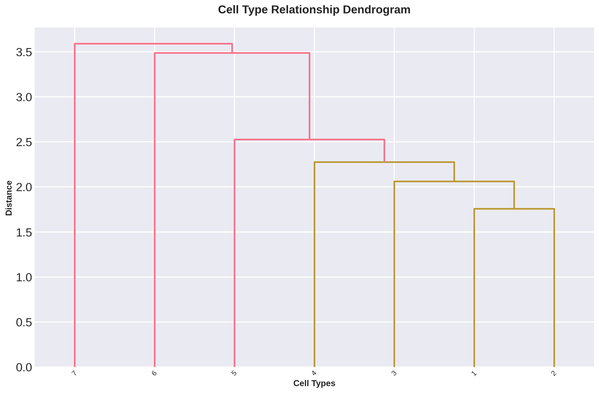

# ATAC pipeline tutorial

The scATAC-seq pipeline mirrors the RNA pipeline but switches preprocessing and clustering to TF-IDF normalization and LSI dimension reduction. It ends at the same dual sample embedding; everything downstream of that is shared with RNA and lives in the [Downstream analysis tutorials](downstream/index.md). Parameter values follow the canonical [`config_covid_rna.yaml`](https://github.com/) (ATAC block).

## Inputs

- `ATAC.h5ad` — cell × peak counts; `.obs` must carry a `sample` column.
- `sample_meta.csv` — per-sample metadata including any phenotype of interest (e.g. `sev.level`).

Output lands under `output_dir/atac/`.

## 1. Preprocessing

TF-IDF normalization, LSI projection, optional doublet removal, and Harmony integration. ATAC typically uses a high feature count (50,000) and 50 LSI components.

```python
from genodistance.preparation import preprocess_linux  # ATAC version

adata_cluster, adata_sample = preprocess_linux(
    h5ad_path="/data/test_ATAC.h5ad",
    sample_meta_path="/data/sample_meta.csv",
    output_dir="/results/atac",
    sample_column="sample",
    cell_embedding_num_PCs=50,
    num_cell_hvfs=50000,
    min_cells=1,
    min_features=2000,
    max_features=15000,
    tfidf_scale_factor=1e4,
    log_transform=True,
    drop_first_lsi=True,
    doublet_detection=True,
    num_harmony_iterations=30,
    verbose=True,
)
```

**Writes** → `/results/atac/preprocess/adata_cell.h5ad`, `adata_sample.h5ad`.

## 2. Cell-type clustering

`cell_types_linux` auto-detects `X_lsi_harmony` in `.obsm` and switches to cosine-metric neighborhood graphs for ATAC.

```python
from genodistance.preparation import cell_types_linux

adata_cluster, adata_sample = cell_types_linux(
    anndata_cell=adata_cluster,
    anndata_sample=adata_sample,
    leiden_cluster_resolution=0.8,
    n_target_clusters=None,
    umap=False,
    save=True,
    output_dir="/results/atac",
)
```

**Writes** → updated h5ad files.

A hierarchical view of the resulting cell types helps sanity-check the granularity:


<div class="figure-caption">Step 2 — Hierarchical dendrogram across Leiden-derived ATAC cell types (produced later by the visualization step, shown here for context).</div>

## 3. Sample embedding

Set `atac=True` so that pseudobulk aggregation and dimension reduction use LSI-style processing instead of log-normalized PCA.

```python
from genodistance.sample_embedding import calculate_sample_embedding

pseudo_dict, pseudo_adata = calculate_sample_embedding(
    adata=adata_sample,
    sample_col="sample",
    celltype_col="cell_type",
    batch_col=None,
    output_dir="/results/atac",
    sample_hvg_number=50000,
    n_expression_components=30,
    n_proportion_components=10,
    harmony_for_proportion=True,
    use_gpu=True,
    atac=True,
    save=True,
)
```

**Writes** → `/results/atac/pseudobulk/pseudobulk_sample.h5ad` with the two embeddings in `.obsm`.

---

Everything after sample embedding (sample distance, trajectory, DGE, clustering, RAISIN, visualization, optional resolution search) is a downstream task and is documented under [Downstream analysis](downstream/index.md).
