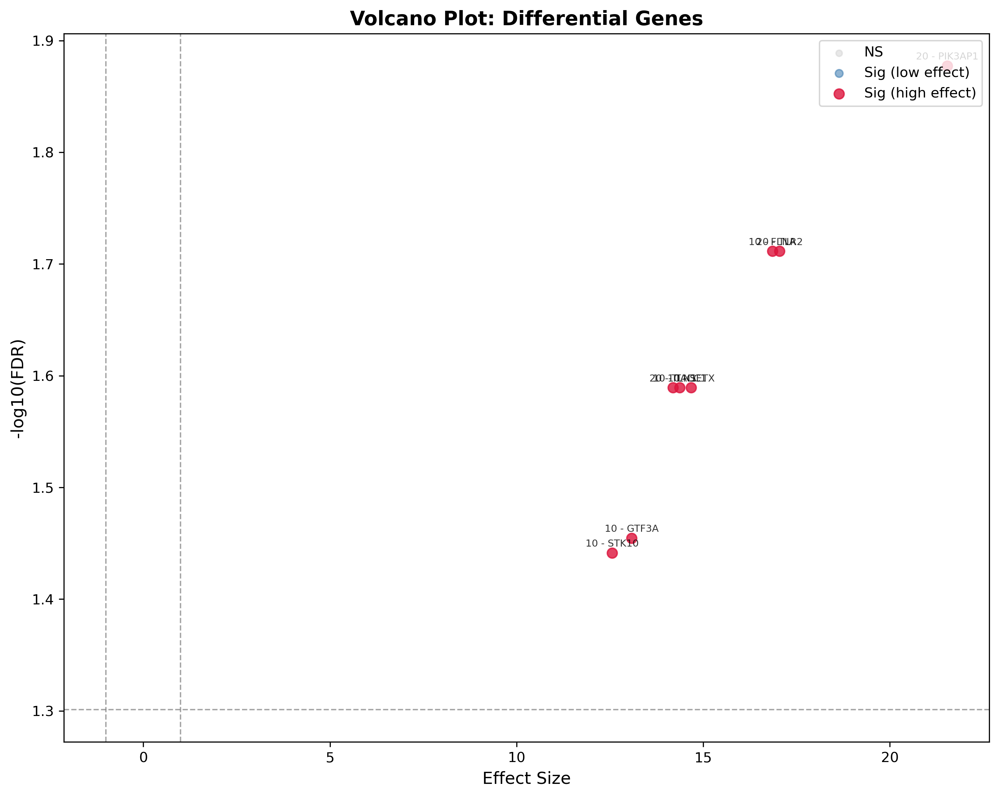
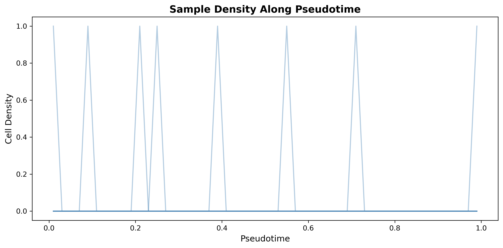
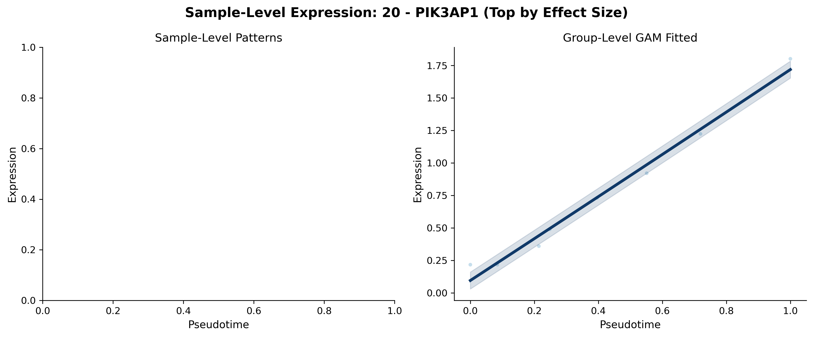
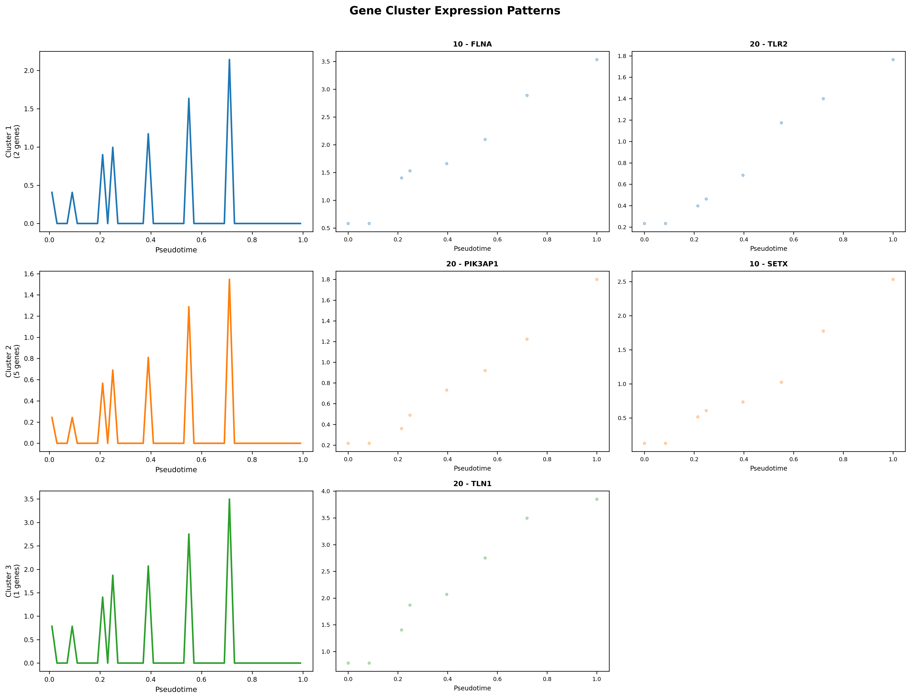
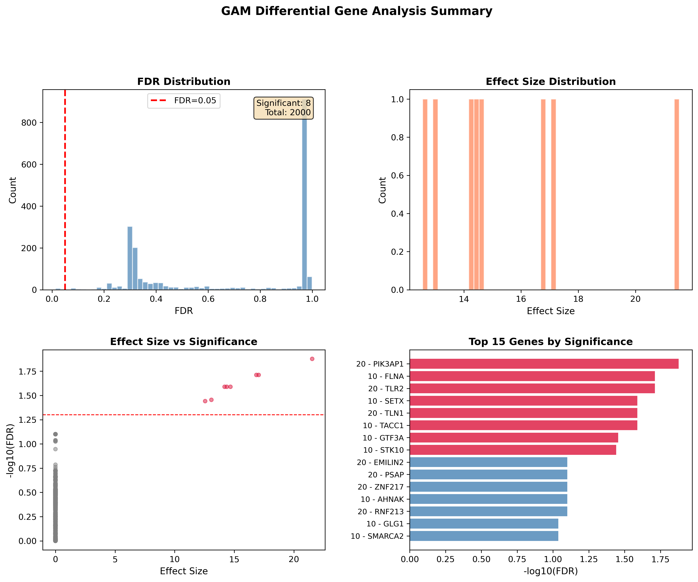

# Downstream analysis

Once you have a `pseudobulk_sample.h5ad` from any of the three pipelines, every downstream module runs off the same object. This tutorial uses outputs from the RNA COVID run; the calls are identical for ATAC and multi-omics.

```python
import anndata as ad
pseudo_adata = ad.read_h5ad("/results/rna/pseudobulk/pseudobulk_sample.h5ad")
adata_cell   = ad.read_h5ad("/results/rna/preprocess/adata_cell.h5ad")
```

## 1. Sample distance (multiple metrics)

`sample_distance` supports a handful of metrics — standard vector metrics on the dimension-reduced embeddings (`cosine`, `correlation`, `euclidean`, ...) plus distribution-level distances (`EMD`, `chi_square`, `jensen_shannon`).

```python
from genodistance.sample_distance import sample_distance

for method in ["cosine", "correlation"]:
    sample_distance(
        adata=pseudo_adata,
        output_dir="/results/rna",
        method=method,
        data_type="RNA",
        grouping_columns=["sev.level"],
    )
```

**Writes** → `/results/rna/Sample_distance/{method}/{expression,proportion}_DR_heatmap_*.pdf` and the underlying CSV.


<div class="figure-caption">Step 1 — Pairwise sample-distance heatmaps under cosine and correlation metrics on both embeddings.</div>

## 2. Supervised pseudotime (CCA)

Projects samples onto the axis of maximal correlation with a phenotype column in `pseudo_adata.obs`. The function automatically selects the best two PCs for 2D visualization when `auto_select_best_2pc=True` (the default).

```python
from genodistance.sample_trajectory import CCA_Call

cca = CCA_Call(
    adata=pseudo_adata,
    output_dir="/results/rna",
    trajectory_col="sev.level",
    n_components=10,
    auto_select_best_2pc=True,
    verbose=True,
)
```

**Writes** → `/results/rna/CCA/pca_10d_cca_{expression,proportion}.pdf` and a contribution plot highlighting which PCs drive the axis.


<div class="figure-caption">Step 2 — Samples projected onto the severity-maximizing CCA axis, with a breakdown of which PCs matter most.</div>

## 3. CCA permutation p-value

Assess whether the CCA correlation is unusual under random label shuffling.

```python
from genodistance.sample_trajectory import cca_pvalue_test

for column in ["X_DR_expression", "X_DR_proportion"]:
    cca_pvalue_test(
        pseudo_adata=pseudo_adata,
        column=column,
        input_correlation=cca[column]["score"],
        output_directory="/results/rna",
        num_simulations=1000,
        trajectory_col="sev.level",
    )
```

**Writes** → `/results/rna/CCA_test/cca_pvalue_distribution_{column}.png` and CSV summary.


<div class="figure-caption">Step 3 — Null distribution of CCA correlations from 1,000 permutations with the observed value overlaid.</div>

## 4. Unsupervised pseudotime (TSCAN)

GMM + minimum spanning tree on the sample embedding. `n_clusters=None` lets BIC choose, and `origin=None` picks a random endpoint.

```python
from genodistance.sample_trajectory import TSCAN

tscan_expr = TSCAN(
    AnnData_sample=pseudo_adata,
    column="X_DR_expression",
    n_clusters=None,
    output_dir="/results/rna",
    grouping_columns=["sev.level"],
    origin=None,
    pseudotime_mode="rank",
)
```

**Writes** → `/results/rna/TSCAN/` with cluster-colored and grouping-colored trajectory plots.


<div class="figure-caption">Step 4 — TSCAN trajectories on both embeddings, colored either by the inferred cluster or by the phenotype.</div>

## 5. Trajectory differential gene analysis (GAM)

Fit a GAM per gene against pseudotime, rank by effect size + FDR. Accepts pseudotime from step 2 or step 4.

```python
from genodistance.sample_trajectory import run_trajectory_gam_differential_gene_analysis

results_df = run_trajectory_gam_differential_gene_analysis(
    pseudobulk_adata=pseudo_adata,
    pseudotime_source=cca["X_DR_expression"]["pseudotime"],
    sample_col="sample",
    pseudotime_col="pseudotime",
    covariate_columns=None,
    fdr_threshold=0.05,
    effect_size_threshold=1.0,
    top_n_genes=100,
    num_splines=5,
    spline_order=2,
    output_dir="/results/rna/trajectoryDEG/expression",
    generate_visualizations=True,
    n_clusters=3,
    top_n_genes_for_curves=20,
)
```

**Writes** → `trajectoryDEG/expression/` (results CSV + `visualizations/` folder):

| File | Shows |
| --- | --- |
| `pseudoDEGs.csv` | gene, effect size, p-value, FDR, rank |
| `visualizations/tde_heatmap.png` | expression of top genes across pseudotime-ordered samples |
| `visualizations/gene_curves.png` | GAM smooths for the top N genes |
| `visualizations/volcano_plot.png` | effect size vs. −log10 FDR |
| `visualizations/sample_density.png` | sample distribution along pseudotime |
| `visualizations/sample_level_curves.png` | per-sample raw + fitted curves |
| `visualizations/cluster_patterns.png` | grouped curves for each gene cluster |
| `visualizations/results_summary.png` | one-page diagnostic summary |







<div class="figure-caption">Step 5 — Visualizations generated by the GAM-based trajectory differential gene analysis.</div>

## 6. Sample clustering

```python
from genodistance import cluster

expr_clusters, prop_clusters = cluster(
    pseudobulk_adata=pseudo_adata,
    output_dir="/results/rna",
    number_of_clusters=4,
    use_expression=True,
    use_proportion=True,
    random_state=0,
)
```

**Writes** → `/results/rna/sample_cluster/kmeans_clusters_{expression,proportion}.csv` + embedding scatter PNGs.


## 7. Proportion test

Limma-style eBayes test on logit-transformed cell-type proportions, comparing groups defined either by a `.obs` column or by the `sample_to_clade` mapping from step 6.

```python
from genodistance.sample_clustering import proportion_test

proportion_test(
    adata=adata_cell,
    sample_col="sample",
    sample_to_clade=expr_clusters,
    celltype_col="cell_type",
    output_dir="/results/rna/sample_cluster/expression",
)
```

**Writes** → `sample_cluster/expression/proportion_test/` with a heatmap of per-sample proportions and a significance matrix.


<div class="figure-caption">Step 7 — Cell-type proportions per sample (left) and a cluster × cell-type significance matrix (right).</div>

## 8. Cluster DGE (RAISIN)

Fit the RAISIN mixed-effect model, then run all pairwise comparisons between sample clusters.

```python
from genodistance.sample_clustering import raisinfit, run_pairwise_tests

fit = raisinfit(
    adata=adata_cell,
    sample_col="sample",
    sample_to_clade=expr_clusters,
    testtype="unpaired",
    group_col=None,
    batch_col=None,
    intercept=True,
    filtergene=False,
    n_jobs=8,
    verbose=True,
)

run_pairwise_tests(
    fit=fit,
    output_dir="/results/rna/raisin_results_expression",
    fdrmethod="fdr_bh",
    n_permutations=100,
    fdr_threshold=0.05,
    top_n_genes=50,
    make_summary_plots=True,
)
```

**Writes** → `raisin_results_expression/`:

- One subdirectory per pair (`0_vs_1/`, `0_vs_2/`, ...) each containing `raisin_results.csv` and `volcano.png`.
- `summary_plots/pseudobulk_heatmap.png` — top DE genes across all clusters.
- `summary_plots/summary_dotplot.png` — per-pair DE counts.


<div class="figure-caption">Step 8 — RAISIN pairwise cluster differential expression. Left: one pair's volcano. Middle: cross-cluster pseudobulk heatmap of top genes. Right: DE gene count per comparison.</div>

## 9. General visualization

Finally, `visualization` bundles a dendrogram, proportion PCA, and expression UMAP into one call. Toggle whichever panels you want.

```python
from genodistance.visualization import visualization

visualization(
    AnnData_cell=adata_cell,
    pseudobulk_anndata=pseudo_adata,
    output_dir="/results/rna/visualization",
    grouping_columns=["sev.level"],
    age_bin_size=None,
    age_column="age",
    plot_dendrogram_flag=True,
    plot_cell_type_proportions_pca_flag=True,
    plot_cell_type_expression_umap_flag=True,
)
```

**Writes** → `/results/rna/visualization/` with `cell_type_dendrogram.png` and per-grouping PCA/UMAP plots.

---

You now have the full downstream stack. The same calls apply to ATAC pseudobulks and multi-omics pseudobulks; only the input AnnData changes.
