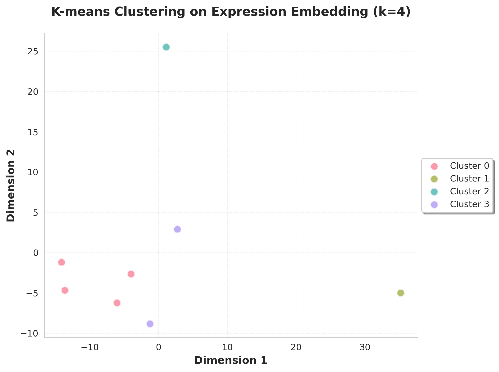

# Sample clustering

`cluster` runs K-means on `X_DR_expression` and `X_DR_proportion` independently and returns two `{sample_id: cluster_label}` dicts. The assignments are the standard input to [`proportion_test`](proportion_test.md) and [`raisinfit`](raisin_dge.md) via their `sample_to_clade` arguments.

## Call

```python
from genodistance import cluster

expr_clusters, prop_clusters = cluster(
    pseudobulk_adata=pseudo_adata,
    output_dir="/results/rna",
    number_of_clusters=4,
    use_expression=True,
    use_proportion=True,
    random_state=0,
)
```

## Output

**Writes** → `/results/rna/sample_cluster/`:

- `kmeans_clusters_expression.csv`, `kmeans_clusters_proportion.csv` — sample ↔ cluster tables.
- `kmeans_expression_embedding.png`, `kmeans_proportion_embedding.png` — 2D scatters colored by cluster.

The pseudobulk AnnData also gets `cluster_expression_kmeans` / `cluster_proportion_kmeans` columns in `.obs`.

## Result



<div class="figure-caption">Sample clusters on the first two components of each embedding.</div>

See the [API page](../../api/downstream/cluster.md) for the full parameter list.
