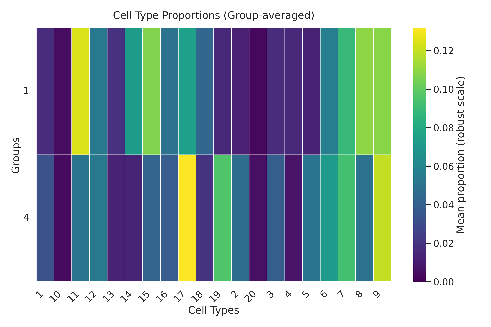
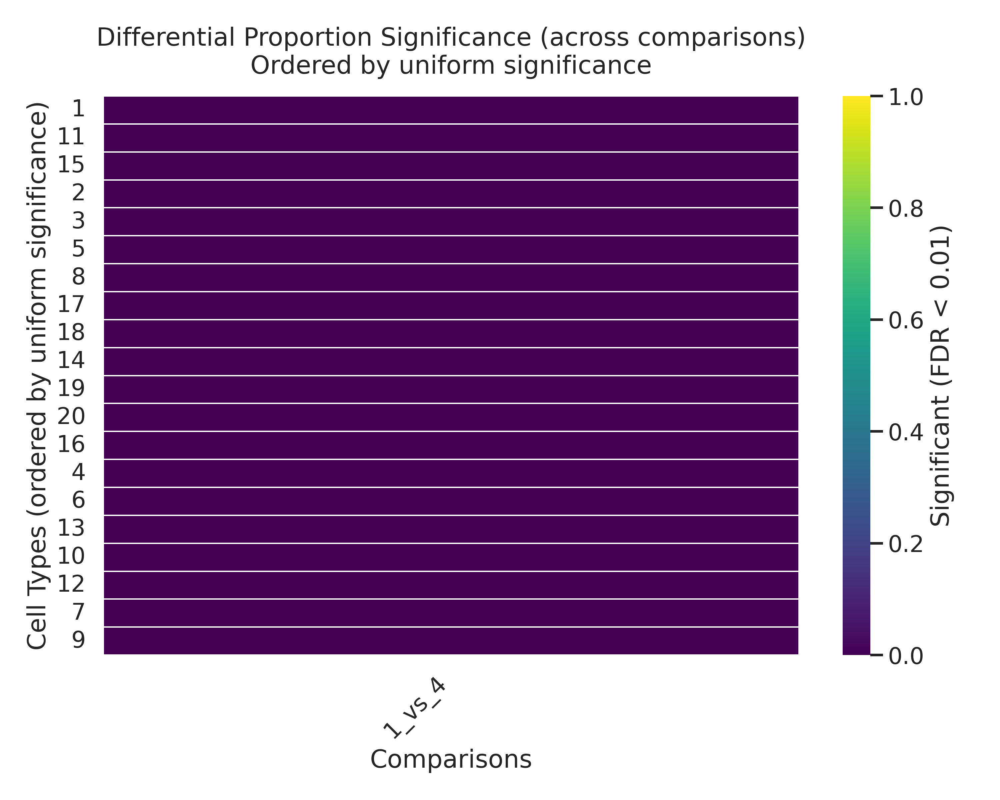

# Proportion test

Tests whether cell-type proportions differ across groups. Logit-transforms per-sample proportions, then applies a limma-style empirical-Bayes moderated F-test. Groups can be supplied either via a `.obs` column (`group_col`) or via a `{sample_id: cluster}` mapping (`sample_to_clade`) from [`cluster`](cluster.md).

## Call

```python
from genodistance.sample_clustering import proportion_test

proportion_test(
    adata=adata_cell,
    sample_col="sample",
    sample_to_clade=expr_clusters,     # from cluster(...)
    celltype_col="cell_type",
    output_dir="/results/rna/sample_cluster/expression",
)
```

## Output

**Writes** → `/results/rna/sample_cluster/expression/proportion_test/`:

- `proportion_test_results.csv` — per cell-type F, p-value, FDR, effect size.
- `proportion_heatmap_group_by_celltype.png` — sample × cell-type proportion heatmap grouped by cluster.
- `proportion_significance_matrix.png` — cluster × cell-type significance grid.

## Result



<div class="figure-caption">Per-sample cell-type proportions (left) and which cluster × cell-type combinations are significantly enriched or depleted (right).</div>

See the [API page](../../api/downstream/proportion_test.md) for the full parameter list.
