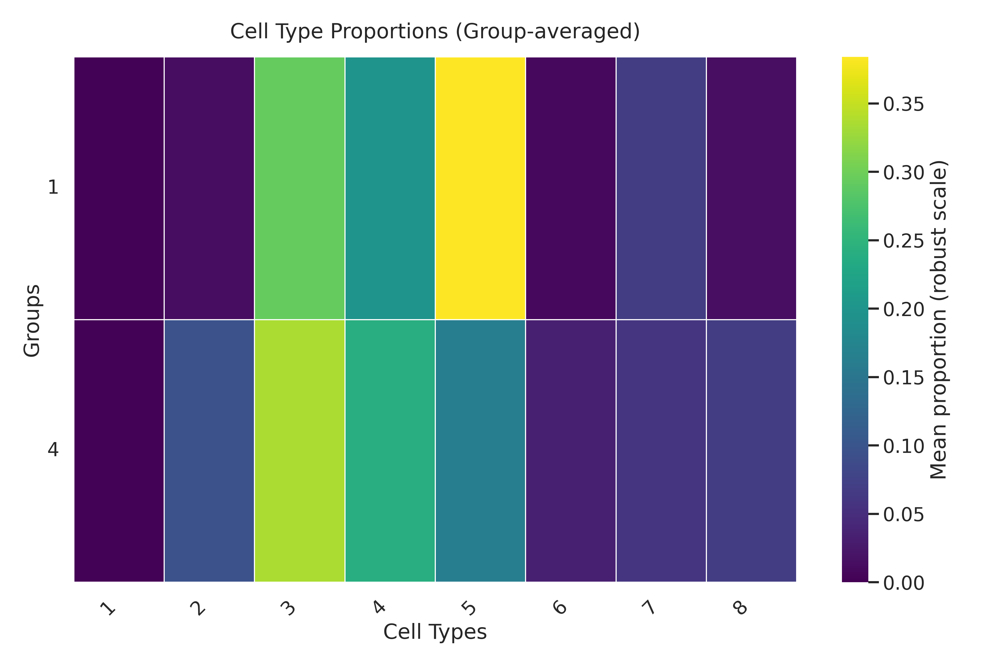
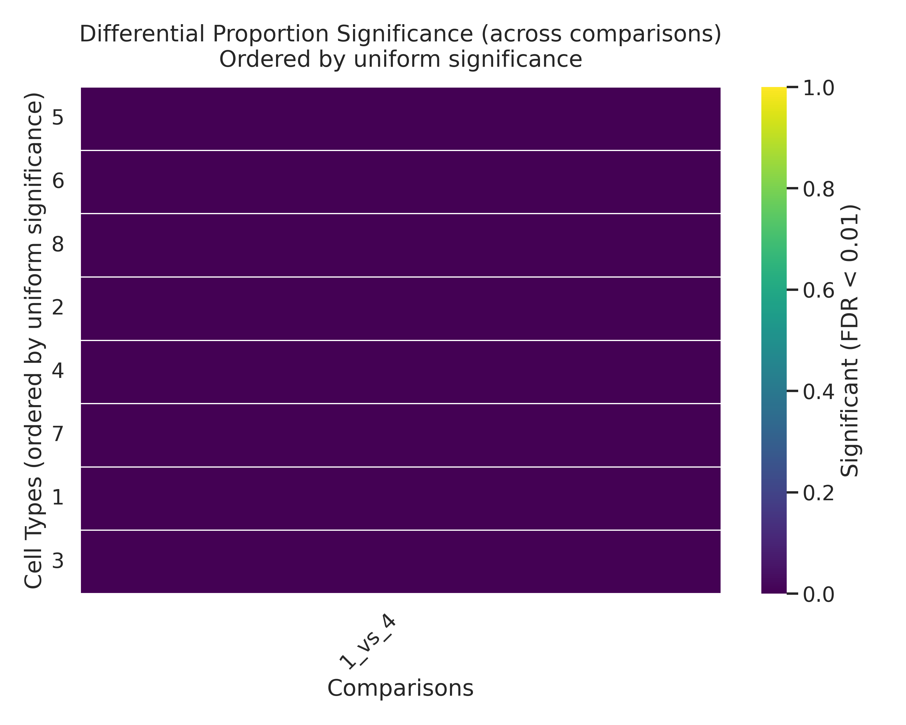

# Proportion test

Tests whether cell-type proportions differ across groups. CLR-transforms (centered log-ratio) per-sample proportions, then applies a limma-style empirical-Bayes moderated t-test for every pair of groups, with Benjamini–Hochberg FDR applied globally across all (pair × cell-type) hypotheses. Groups can be supplied either via a `.obs` column (`group_col`) or via a `{sample_id: cluster}` mapping (`sample_to_clade`) from [`cluster`](cluster.md).

## Call

```python
from sampledisco.sample_clustering.proportion_test import proportion_test

proportion_test(
    adata=adata_cell,
    sample_col="sample",
    sample_to_clade=expr_clusters,     # from cluster(...)
    celltype_col="cell_type",
    output_dir="sampledisco_demo_output/rna/sample_cluster/expression",
)
```

## Output

**Writes** → the directory given by `output_dir`:

- `proportion_test_<g1>_vs_<g2>.csv` — one file per group pair: per cell-type `logFC`, `p_value`, `FDR`.
- `proportion_test_significant_summary.txt` — text summary of cell types with `FDR < 0.01`, per comparison.
- `proportion_heatmap_group_by_celltype.png` — group-averaged cell-type proportion heatmap (plus CLR-scale and z-score variants).
- `proportion_significance_matrix.png` — cell-type × comparison significance grid.
- `proportion_boxplot_<g1>_vs_<g2>.png` — proportion boxplots for the top significant cell types of each comparison.

## Result



<div class="figure-caption">Per-sample cell-type proportions (left) and which cluster × cell-type combinations are significantly enriched or depleted (right).</div>

See the [API page](../../api/downstream/proportion_test.md) for the full parameter list.
