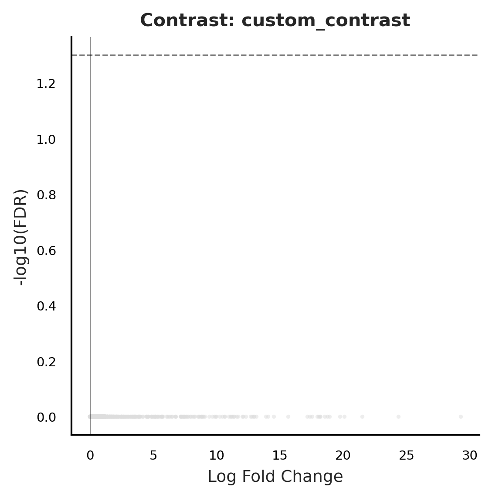
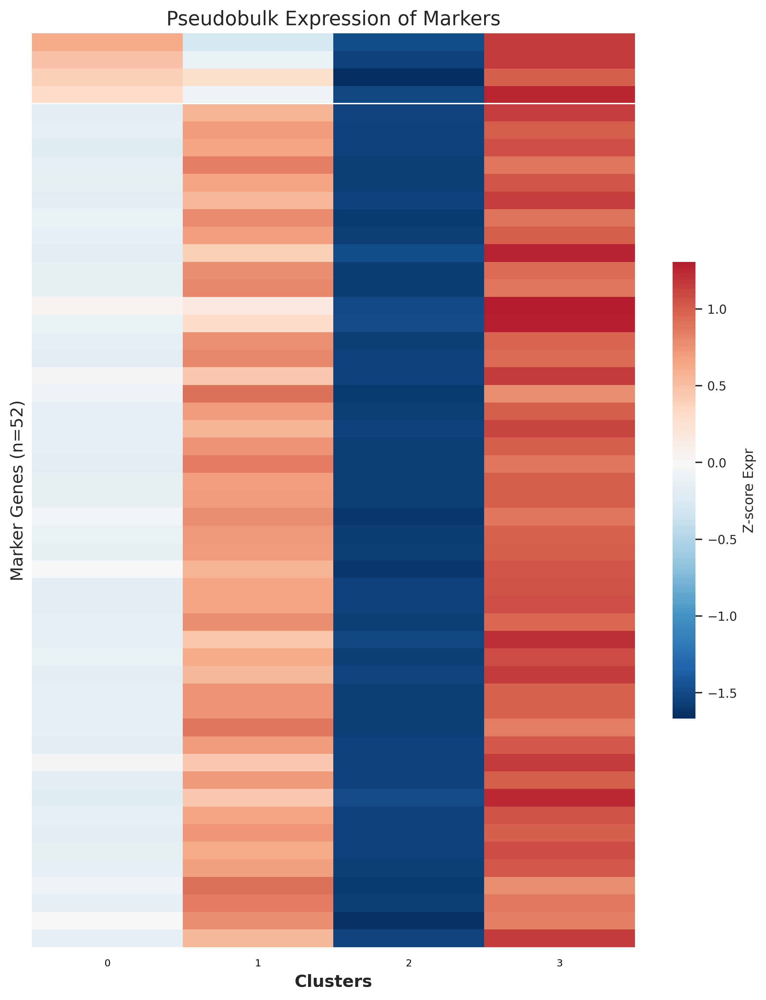
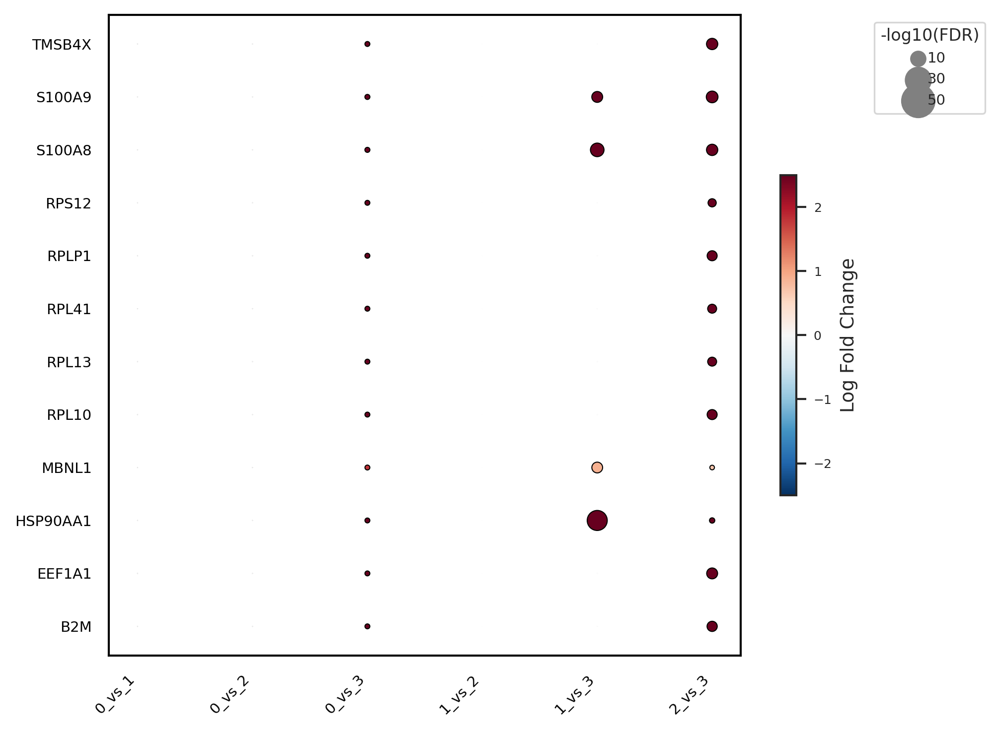

# RAISIN cluster DGE

Two-step cluster-level differential expression: `raisinfit` fits the RAISIN hierarchical GLM (mean + sample-level + cell-level variance components) given a sample-to-cluster mapping, then `run_pairwise_tests` iterates over every group pair and emits volcano plots, results CSVs, and cross-cluster summary figures.

## Call

```python
from genodistance.sample_clustering import raisinfit, run_pairwise_tests

fit = raisinfit(
    adata=adata_cell,
    sample_col="sample",
    sample_to_clade=expr_clusters,     # from cluster(...)
    testtype="unpaired",
    group_col=None,
    batch_col=None,
    intercept=True,
    filtergene=False,
    n_jobs=8,
    verbose=True,
)

run_pairwise_tests(
    fit=fit,
    output_dir="/results/rna/raisin_results_expression",
    fdrmethod="fdr_bh",
    n_permutations=100,
    fdr_threshold=0.05,
    top_n_genes=50,
    make_summary_plots=True,
)
```

## Output

**Writes** → `/results/rna/raisin_results_expression/`:

- One subdirectory per pair (`0_vs_1/`, `0_vs_2/`, ...) each containing `raisin_results.csv`, `volcano.png`, and a labeled variant.
- `summary_plots/pseudobulk_heatmap.png` — top DE genes across all clusters.
- `summary_plots/summary_dotplot.png` — per-pair DE counts.
- `summary_plots/all_results_combined.csv`.

## Result




<div class="figure-caption">Left: one pair's volcano. Middle: cross-cluster pseudobulk heatmap of top genes. Right: DE gene count per comparison.</div>

See the API pages for [`raisinfit`](../../api/downstream/raisinfit.md) and [`run_pairwise_tests`](../../api/downstream/run_pairwise_tests.md).
