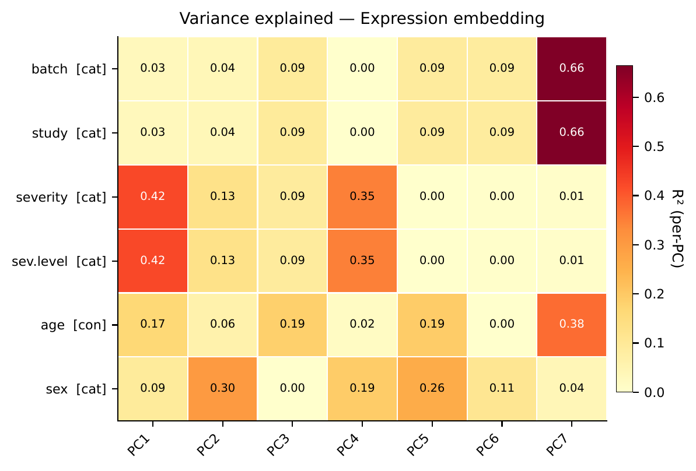
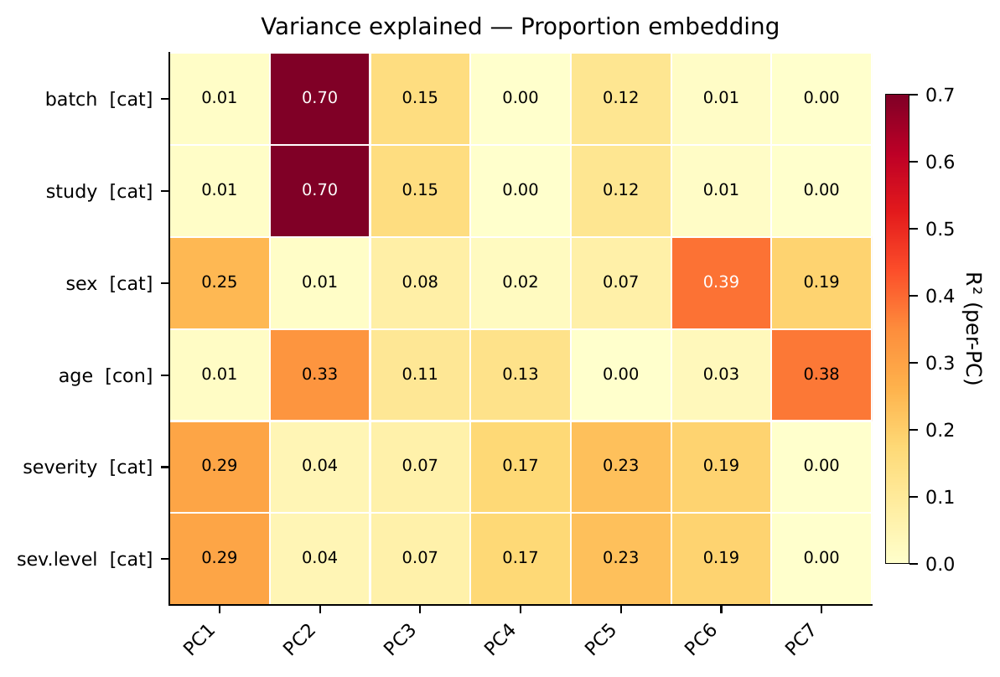
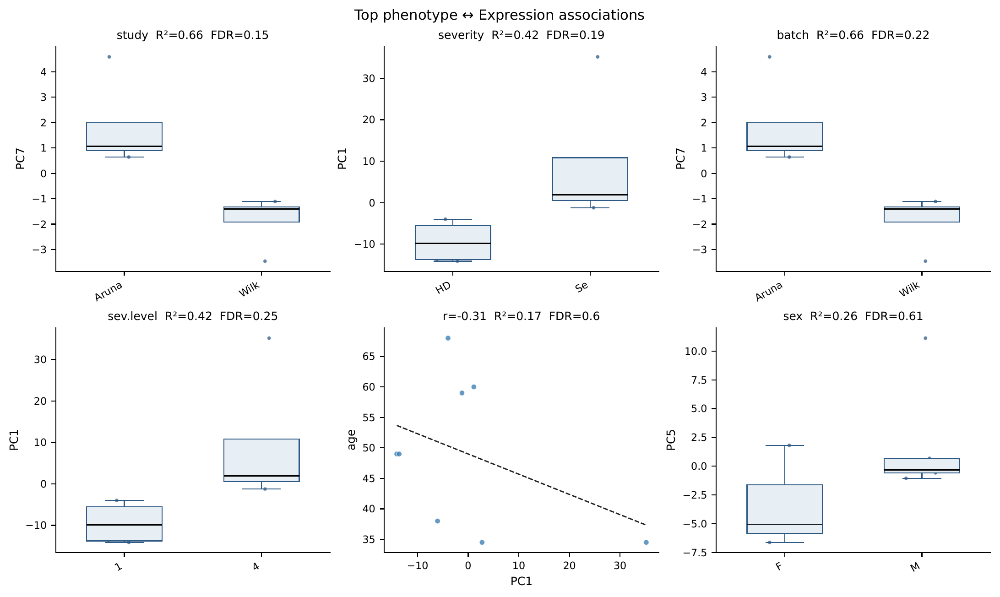
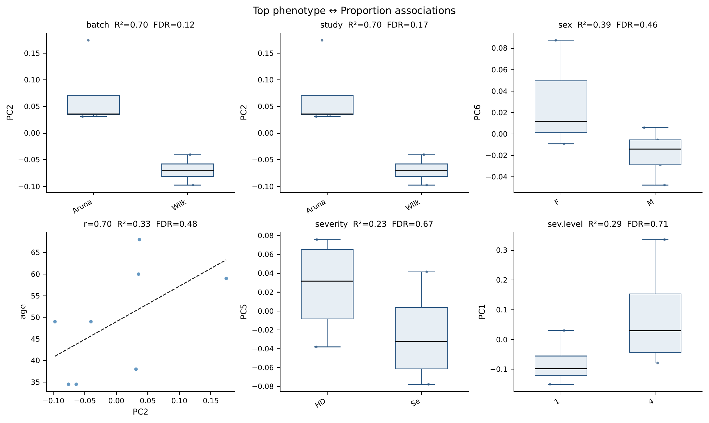

# Dimension association

`run_dimension_association_analysis` tells you which sample-level metadata columns explain the variance of each sample-embedding PC. For every variable in `pseudo_adata.obs` and every component of `X_DR_expression` / `X_DR_proportion`, it fits a linear model, computes R², and attaches a permutation p-value. Continuous variables use a 1-D design (R² = squared Pearson correlation); categorical variables use one-hot (R² = one-way ANOVA η²). The output is a single comparable number per (variable, component), which lets you spot confounders and leading covariates before running trajectory or cluster-DGE tests.

## Call

```python
from genodistance.sample_association import run_dimension_association_analysis

assoc = run_dimension_association_analysis(
    pseudo_adata=pseudo_adata,
    output_dir="/results/rna/sample_association",
    n_permutations=999,
    sample_col="sample",
    random_state=42,
    verbose=True,
)
```

Leave `continuous_cols` and `categorical_cols` as their defaults to let the function auto-classify metadata columns, or pass explicit lists to override.

## Output

**Writes** → `/results/rna/sample_association/`:

- `variance_explained_expression.csv`, `variance_explained_proportion.csv` — one row per `(variable, component)` with `r2`, `perm_p`, `fdr`, `pearson_r`, `spearman_r`, `n`, `n_levels`.
- `figures/expression_variance_heatmap.pdf`, `figures/proportion_variance_heatmap.pdf` — variable × component R² heatmaps.
- `figures/expression_top_associations.pdf`, `figures/proportion_top_associations.pdf` — curated scatter / box panels for the strongest associations.

## Result



<div class="figure-caption">R² of each metadata variable (rows) against each sample-embedding component (columns), separately for the expression and proportion embeddings. Stars mark permutation-significant associations.</div>



<div class="figure-caption">Curated panels for the strongest variable–component pairs. Continuous variables are rendered as scatterplots with fitted lines; categorical variables as boxplots across levels.</div>

See the [API page](../../api/downstream/sample_association.md) for the full parameter list.
