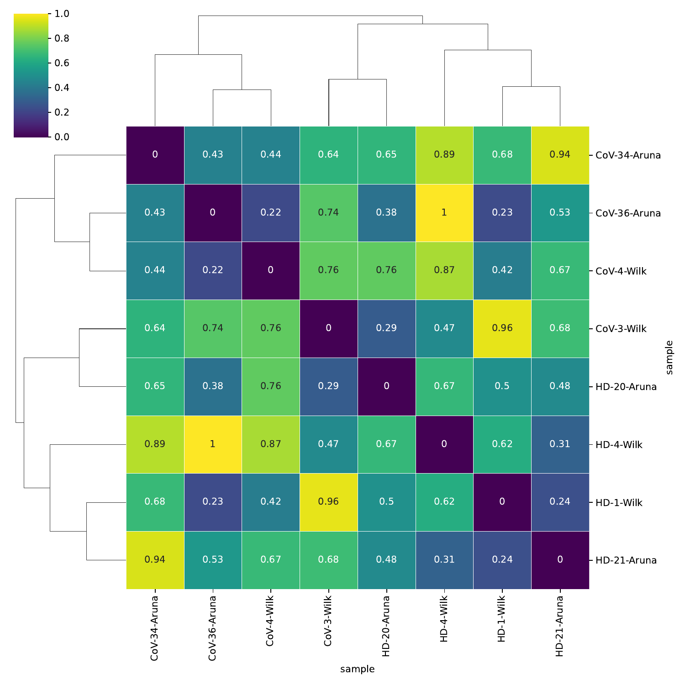
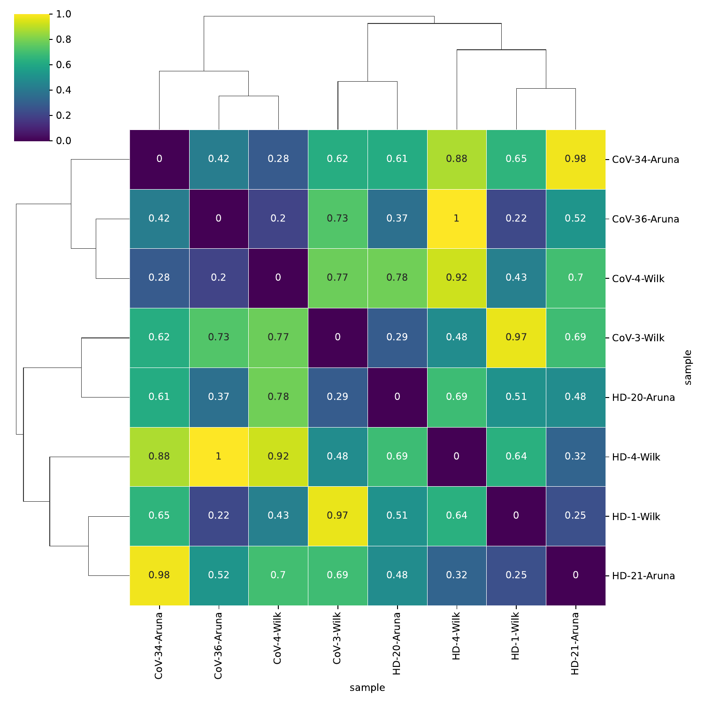

# Sample distance

`sample_distance` computes the pairwise distance matrix across samples using the chosen metric. Call it once per metric; each call writes its own heatmap and CSV. Standard vector metrics (`cosine`, `correlation`, `euclidean`, ...) operate on the single sample embedding `uns['X_DR_sample']`; distribution metrics (`EMD`, `chi_square`, `jensen_shannon`) operate on cell-type proportions and require the cell-level AnnData via `cell_adata`.

## Call

```python
from sampledisco.sample_distance.sample_distance import sample_distance

for method in ["cosine", "correlation"]:
    sample_distance(
        adata=adata,
        output_dir="sampledisco_demo_output/rna",
        method=method,
        data_type="RNA",
        grouping_columns=["sev.level"],
    )
```

Here `adata` is the cell-level AnnData carrying the sample embedding in `adata.uns['X_DR_sample']` (written in place by `compute_sample_embedding`). For the distribution metrics, also pass `cell_adata=adata`:

```python
sample_distance(
    adata=adata,
    output_dir="sampledisco_demo_output/rna",
    method="EMD",
    data_type="RNA",
    cell_adata=adata,
    sample_column="sample",
    cell_type_column="cell_type",
    grouping_columns=["sev.level"],
)
```

## Output

**Writes** → `sampledisco_demo_output/rna/{method}/`:

- `sample_DR_coordinates.csv` and `distance_matrix_sample_DR.csv`
- `sample_distance_sample_DR_heatmap.pdf`
- `distance_statistics_summary_{method}.csv`
- Group-summary results via `distanceCheck` when `grouping_columns` is set.

For `EMD`, outputs go under `sampledisco_demo_output/rna/EMD_distance/` (`distance_matrix_EMD.csv`, `cell_type_proportions.csv`, `cell_type_centroids.csv`, `distance_matrix_EMD_heatmap.pdf`).

## Result


<div class="figure-caption">Sample-embedding distances under the cosine metric. Samples with similar phenotype cluster in the heatmap.</div>


<div class="figure-caption">Sample-embedding distances under the correlation metric.</div>

See the [API page](../../api/downstream/sample_distance.md) for the full parameter list.
