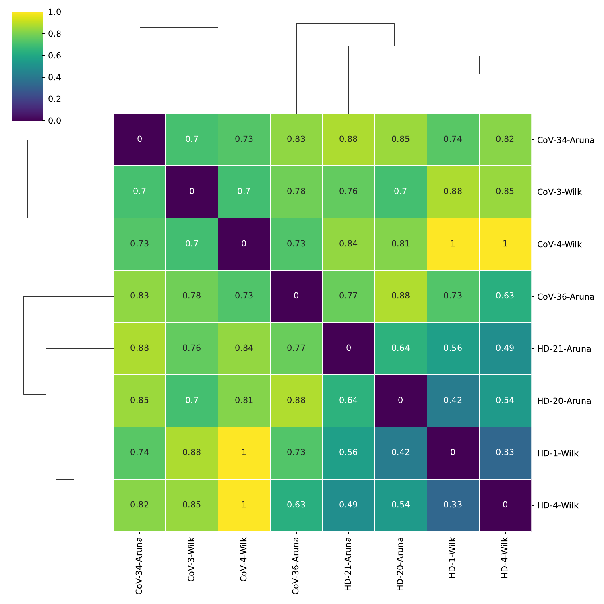
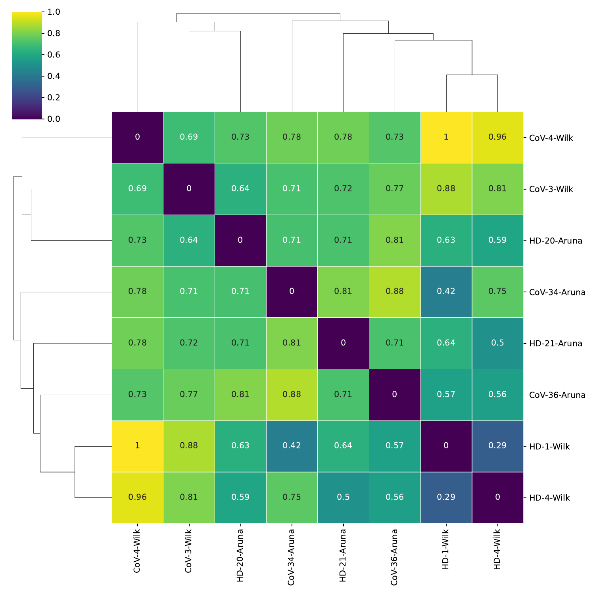
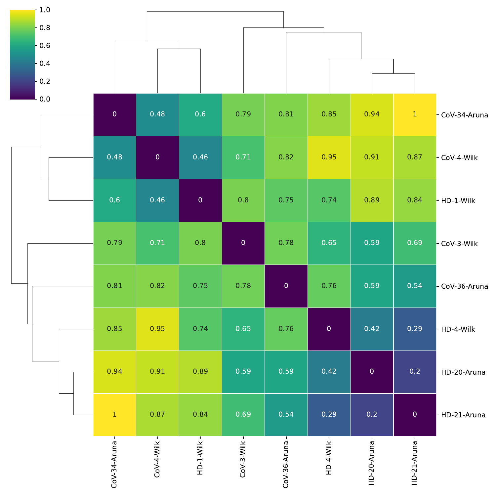

# Sample distance

`sample_distance` computes the pairwise distance matrix across samples using the chosen metric. Call it once per metric; each call writes its own heatmap and CSV. Standard vector metrics (`cosine`, `correlation`, `euclidean`, ...) operate on `X_DR_expression` and `X_DR_proportion`; distribution metrics (`EMD`, `chi_square`, `jensen_shannon`) operate on cell-type proportions and require the cell-level AnnData.

## Call

```python
from genodistance.sample_distance import sample_distance

for method in ["cosine", "correlation"]:
    sample_distance(
        adata=pseudo_adata,
        output_dir="/results/rna",
        method=method,
        data_type="RNA",
        grouping_columns=["sev.level"],
    )
```

## Output

**Writes** → `/results/rna/Sample_distance/{method}/`:

- `distance_matrix_expression_DR.csv`, `distance_matrix_proportion_DR.csv`
- `expression_DR_heatmap_{method}.pdf`, `proportion_DR_heatmap_{method}.pdf`
- Group-summary CSVs when `grouping_columns` is set.

## Result



<div class="figure-caption">Expression-embedding distances under cosine and correlation metrics. Samples with similar phenotype cluster in the heatmap.</div>



<div class="figure-caption">Same metrics on the proportion embedding — complementary to the expression-based view.</div>

See the [API page](../../api/downstream/sample_distance.md) for the full parameter list.
