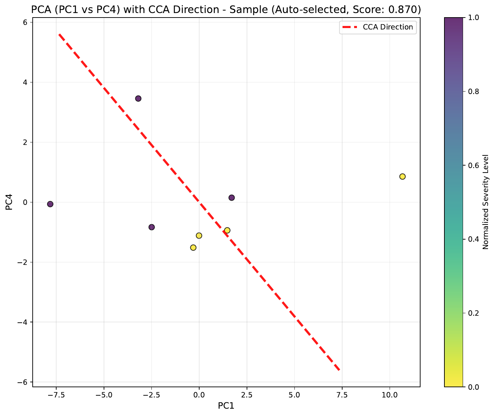
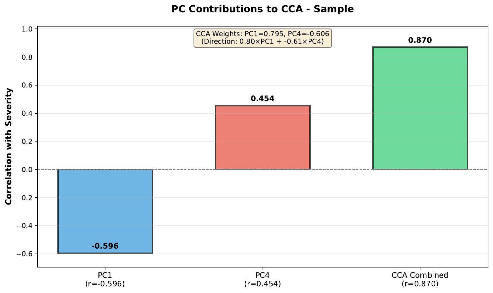

# Trajectory — CCA (supervised)

Canonical Correlation Analysis projects samples onto the one-dimensional axis most correlated with a phenotype column (e.g. severity, age, disease stage). It runs on the single sample embedding `adata.uns['X_DR_sample']`, returning the correlation score and per-sample pseudotime values, and visualizes the projection along the two PCs that contribute most to the axis. Pair it with `cca_pvalue_test` to attach a permutation p-value.

## Call

```python
from sampledisco.sample_trajectory.CCA import CCA_Call
from sampledisco.sample_trajectory.CCA_test import cca_pvalue_test

score_a, score_b, ptime_a, ptime_b = CCA_Call(
    adata=pseudo_adata,
    output_dir="/results/rna",
    trajectory_col="sev.level",
    n_components=2,
    auto_select_best_2pc=True,
    verbose=True,
)

# Single-key world: both score slots hold the same X_DR_sample result.
cca_pvalue_test(
    pseudo_adata=pseudo_adata,
    column="X_DR_sample",
    input_correlation=score_a,
    output_directory="/results/rna",
    num_simulations=1000,
    trajectory_col="sev.level",
)
```

`CCA_Call` returns a legacy 4-tuple `(score_a, score_b, ptime_a, ptime_b)` for back-compat with the wrapper; with the single-key sample embedding both score slots and both pseudotime slots collapse to the same `X_DR_sample` result.

## Output

**Writes** →

- `/results/rna/CCA/pca_2d_cca_sample.pdf` — 2D projection of the sample embedding.
- `/results/rna/CCA/pca_2d_cca_sample_contributions.pdf` — per-PC contribution to the axis.
- `/results/rna/CCA/pseudotime_sample.csv` — per-sample pseudotime along the axis.
- `/results/rna/CCA_test/cca_pvalue_distribution_X_DR_sample.png` — null distribution + observed.

## Result



<div class="figure-caption">Samples projected onto the severity-maximizing axis of <code>X_DR_sample</code>, with a breakdown of which PCs drive it.</div>

See the API pages for [`CCA_Call`](../../api/downstream/trajectory_cca_call.md) and [`cca_pvalue_test`](../../api/downstream/trajectory_cca_pvalue_test.md).
