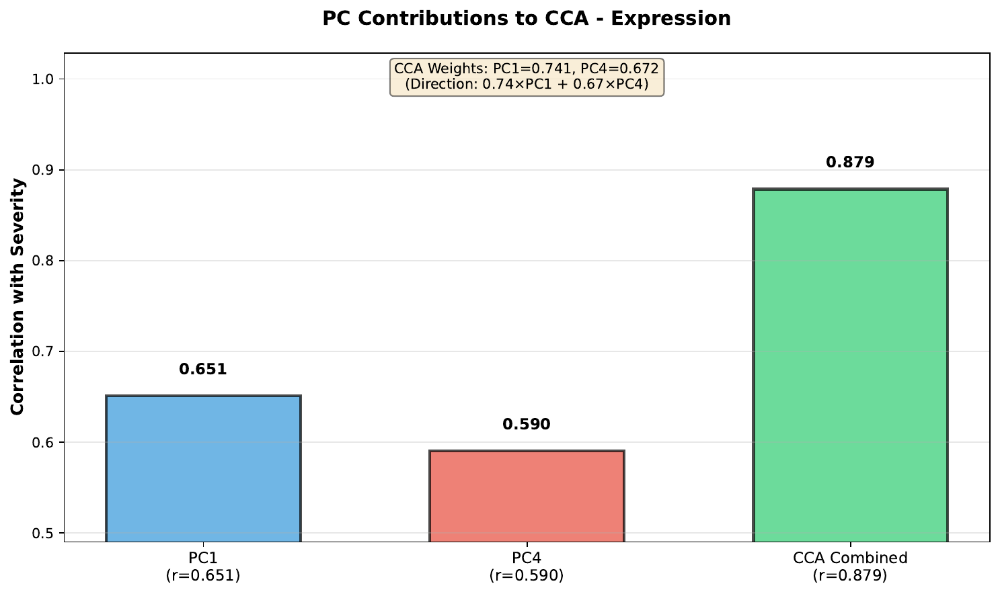
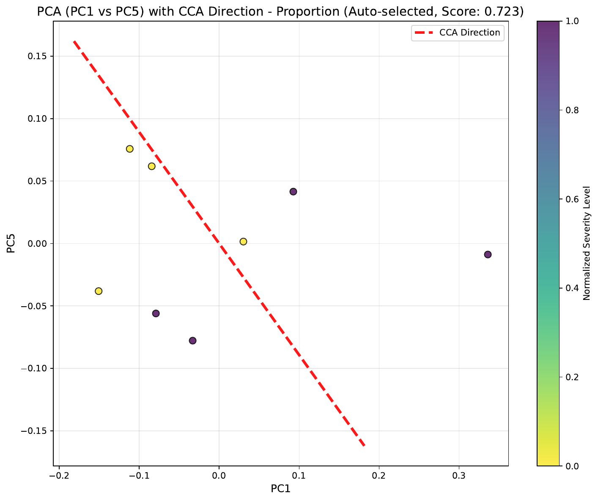
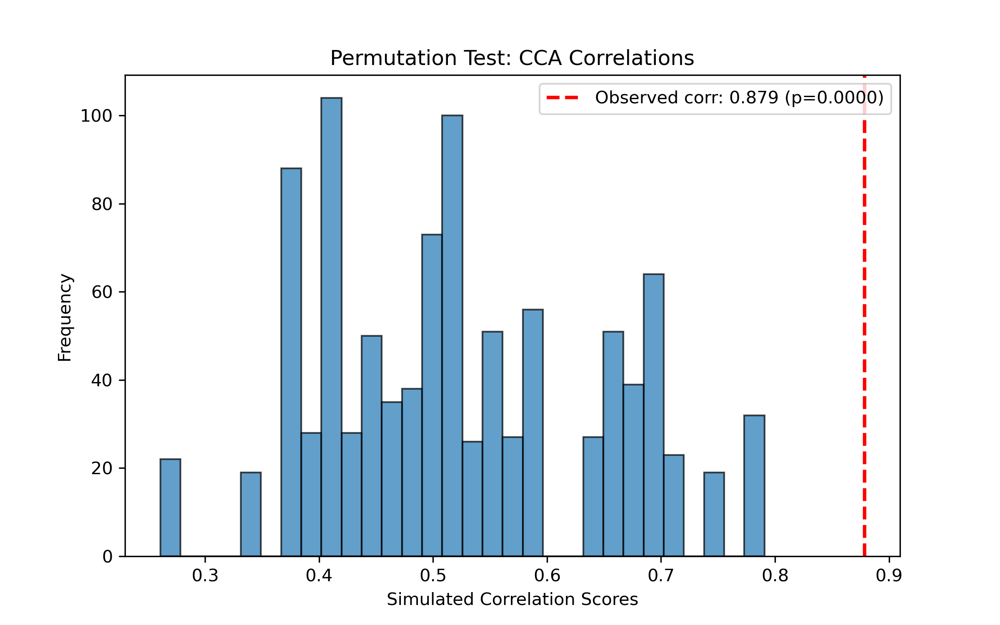
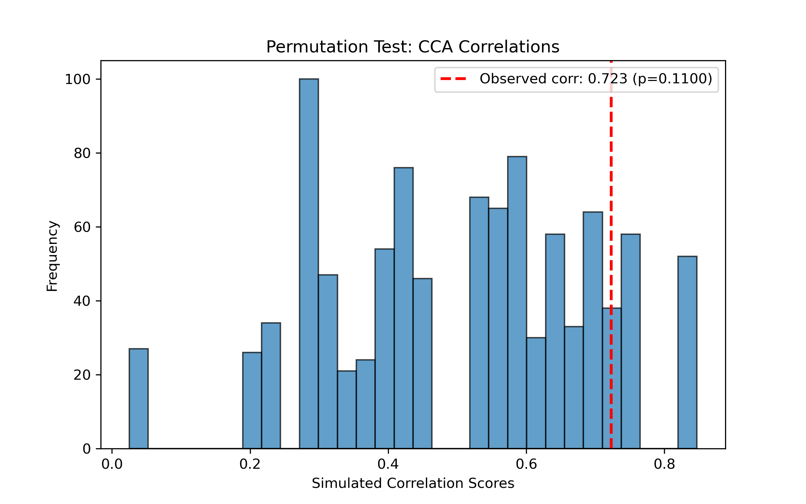

# Trajectory — CCA (supervised)

Canonical Correlation Analysis projects samples onto the one-dimensional axis most correlated with a phenotype column (e.g. severity, age, disease stage). It returns both the correlation score and per-sample pseudotime values for each embedding, and visualizes the projection along the two PCs that contribute most to the axis. Pair it with `cca_pvalue_test` to attach a permutation p-value.

## Call

```python
from genodistance.sample_trajectory import CCA_Call, cca_pvalue_test

prop_score, expr_score, prop_pseudotime, expr_pseudotime = CCA_Call(
    adata=pseudo_adata,
    output_dir="/results/rna",
    trajectory_col="sev.level",
    n_components=10,
    auto_select_best_2pc=True,
    verbose=True,
)

for column, observed in [("X_DR_expression", expr_score), ("X_DR_proportion", prop_score)]:
    cca_pvalue_test(
        pseudo_adata=pseudo_adata,
        column=column,
        input_correlation=observed,
        output_directory="/results/rna",
        num_simulations=1000,
        trajectory_col="sev.level",
    )
```

## Output

**Writes** →

- `/results/rna/CCA/pca_10d_cca_{expression,proportion}.pdf` — 2D projection of each embedding.
- `/results/rna/CCA/pca_10d_cca_expression_contributions.pdf` — per-PC contribution to the axis.
- `/results/rna/CCA_test/cca_pvalue_distribution_{column}.png` — null distribution + observed.

## Result




<div class="figure-caption">Samples projected onto the severity-maximizing axis, with a breakdown of which PCs drive it.</div>



<div class="figure-caption">Null distribution of CCA correlations from 1,000 label permutations with the observed value overlaid.</div>

See the API pages for [`CCA_Call`](../../api/downstream/trajectory_cca_call.md) and [`cca_pvalue_test`](../../api/downstream/trajectory_cca_pvalue_test.md).
