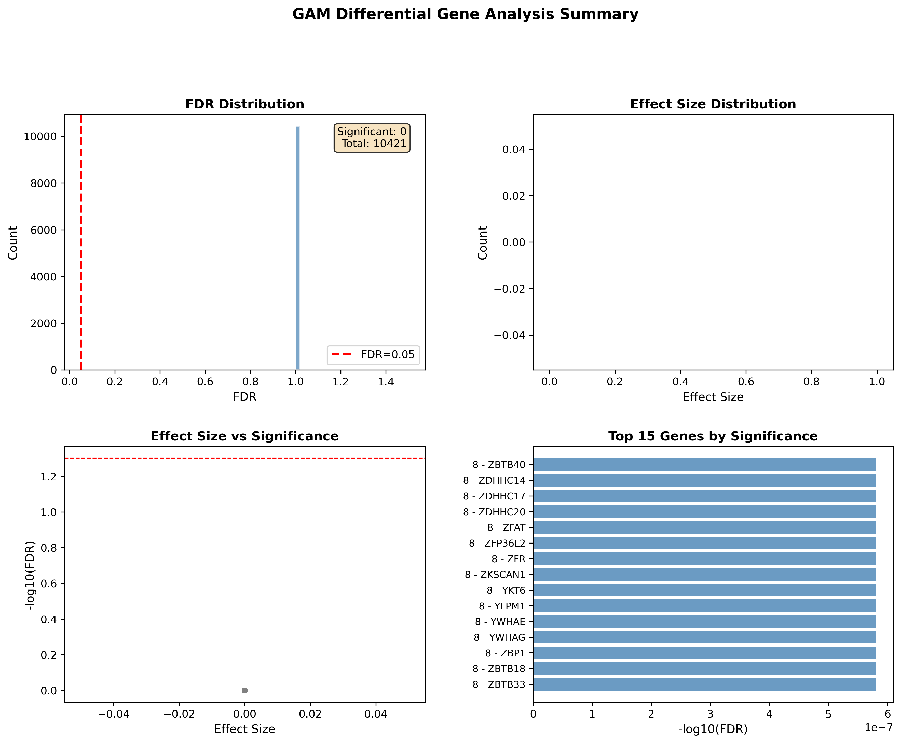
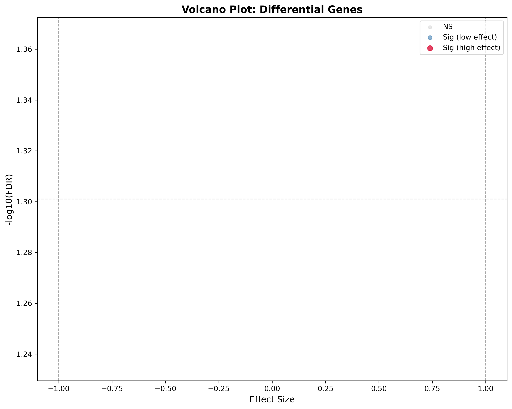
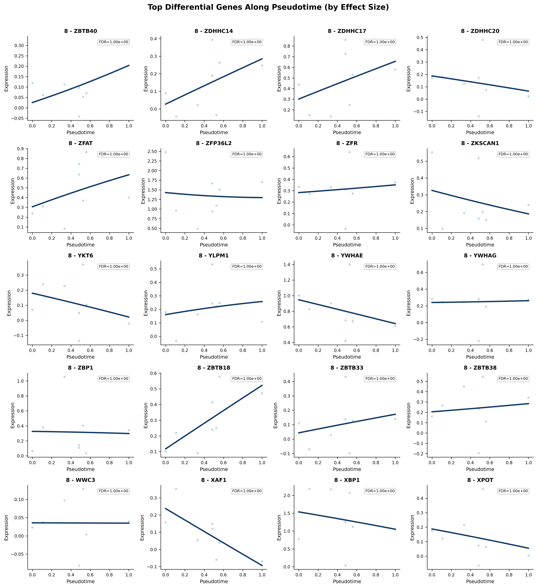
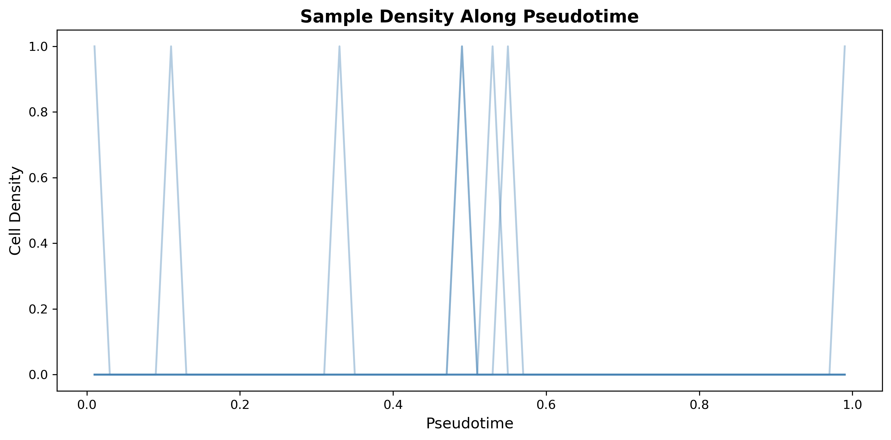
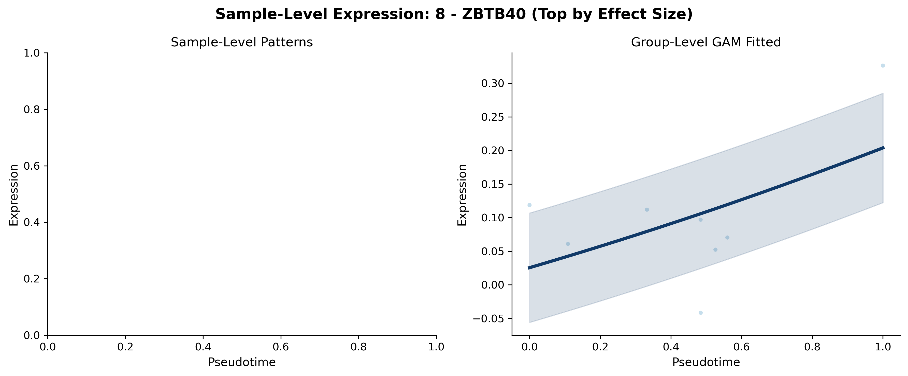

# Trajectory DGE

Given a pseudotime (from [CCA](trajectory_cca.md) or [TSCAN](trajectory_tscan.md)), this step fits a Generalized Additive Model per gene and ranks by effect size + FDR. It emits Lamian-style visualizations: a one-page summary, volcano, per-gene curves, sample density, and per-sample curves.

## Call

The pseudobulk is built **on the fly** from the cell-level `AnnData` (aggregating cells per sample × cell type), so you pass the preprocessed cell-level `adata` — not a separate sample-level object. `pseudotime_source` accepts a dict, a DataFrame, or a path to a CSV/TSV emitted by [CCA](trajectory_cca.md) or [TSCAN](trajectory_tscan.md).

```python
from sampledisco.sample_trajectory.trajectory_diff_gene import (
    run_trajectory_gam_differential_gene_analysis,
)

results_df = run_trajectory_gam_differential_gene_analysis(
    adata,                               # cell-level preprocessed AnnData
    pseudotime_source=expr_pseudotime,   # dict, DataFrame, or CSV/TSV path from CCA/TSCAN
    sample_col="sample",
    celltype_col="cell_type",
    pseudotime_col="pseudotime",
    covariate_columns=None,
    fdr_threshold=0.01,
    effect_size_threshold=1.0,
    top_n_genes=100,
    num_splines=5,
    spline_order=3,
    output_dir="sampledisco_demo_output/rna/trajectoryDEG/expression",
    generate_visualizations=True,
    n_clusters=3,
    top_n_genes_for_curves=20,
    anchor_col=None,                     # orient pseudotime so UP/DOWN are stable
)
```

## Output

**Writes** → `sampledisco_demo_output/rna/trajectoryDEG/expression/`:

| File | Shows |
| --- | --- |
| `gam_all_genes_<ts>.tsv` | Full per-gene result table before filtering. |
| `gam_significant_<ts>.tsv` | Genes below `fdr_threshold`. |
| `gam_pseudoDEGs_<ts>.tsv` | Selected pseudoDEG table (gene, effect size, p-value, FDR, regulation). |
| `gam_summary_<ts>.txt` | Run summary (thresholds, counts, UP/DOWN split). |
| `visualizations/01_results_summary.png` | One-page diagnostic. |
| `visualizations/02_tde_heatmap.png` | Clustered gene-expression heatmap along pseudotime. |
| `visualizations/04_volcano_plot.png` | Effect size vs −log10(FDR). |
| `visualizations/05_gene_curves.png` | GAM fits for the top genes. |
| `visualizations/06_sample_density.png` | Sample distribution along pseudotime. |
| `visualizations/08_sample_level_curves.png` | Per-sample raw + fitted curves. |

## Result






<div class="figure-caption">Visualizations from the GAM-based trajectory DGE step.</div>

See the [API page](../../api/downstream/trajectory_gam_dge.md) for the full parameter list.
