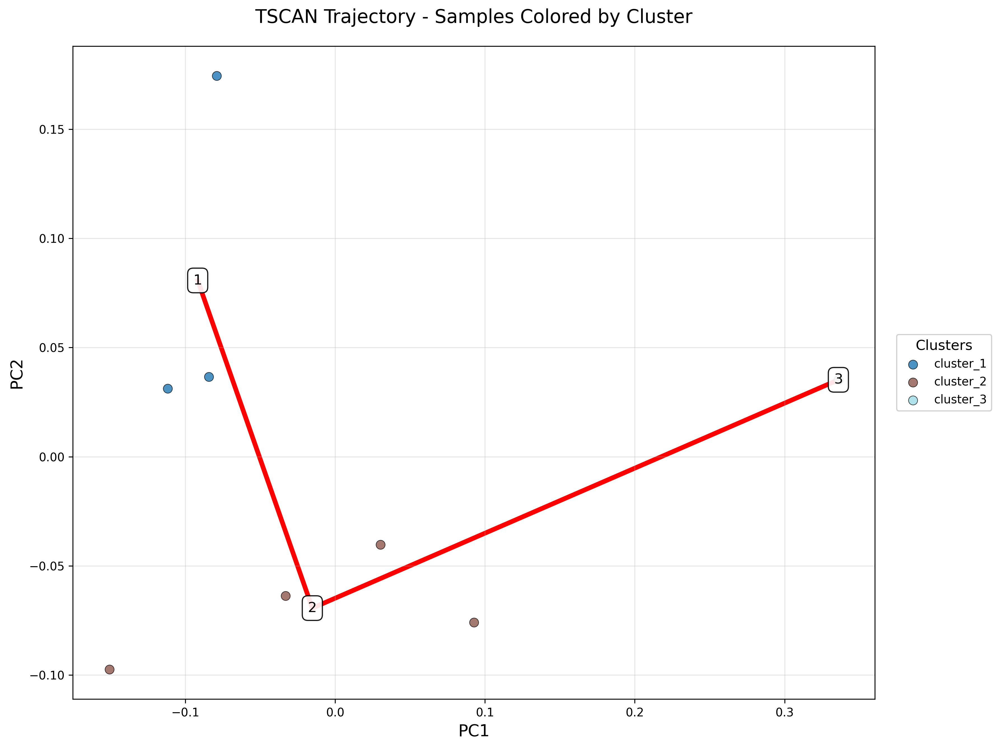
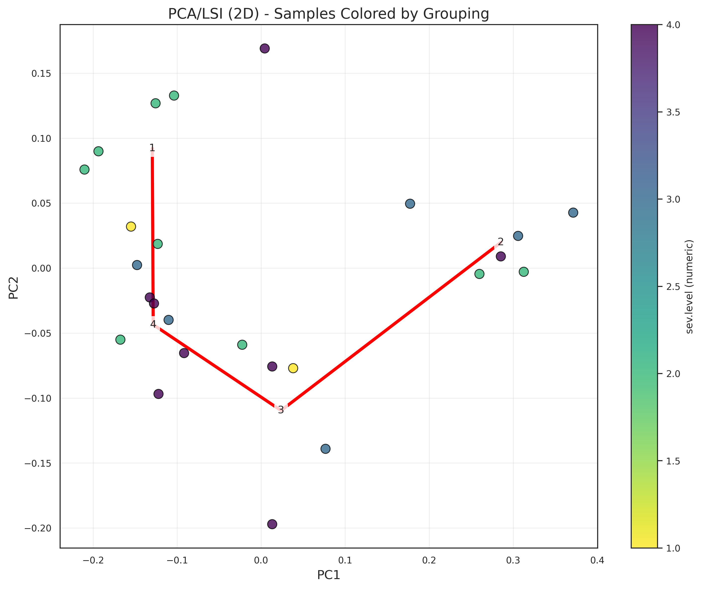

# Trajectory — TSCAN (unsupervised)

When you do not have a supervising phenotype, TSCAN infers a trajectory from the embedding alone: cluster samples with a Gaussian mixture (BIC-selected if `n_clusters=None`), build a minimum spanning tree on cluster centroids, pick the longest path through the tree, and order samples along that path.

## Call

```python
from genodistance.sample_trajectory import TSCAN

tscan_expr = TSCAN(
    AnnData_sample=pseudo_adata,
    column="X_DR_expression",
    n_clusters=None,
    output_dir="/results/rna",
    grouping_columns=["sev.level"],
    origin=None,
    pseudotime_mode="rank",
)
```

Run again with `column="X_DR_proportion"` for the proportion embedding.

## Output

**Writes** → `/results/rna/TSCAN/`:

- `tscan_clusters_by_cluster_{column}.png` — points colored by GMM cluster.
- `tscan_clusters_by_grouping_{column}.png` — points colored by each entry in `grouping_columns`.
- `tscan_pseudotime_{column}.csv` — per-sample pseudotime.

## Result




<div class="figure-caption">Trajectories on both embeddings, colored either by the inferred cluster or by the phenotype.</div>

See the [API page](../../api/downstream/trajectory_tscan.md) for the full parameter list.
