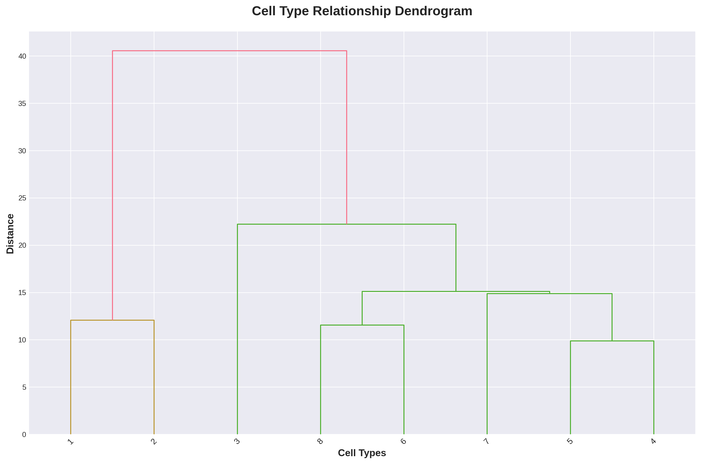
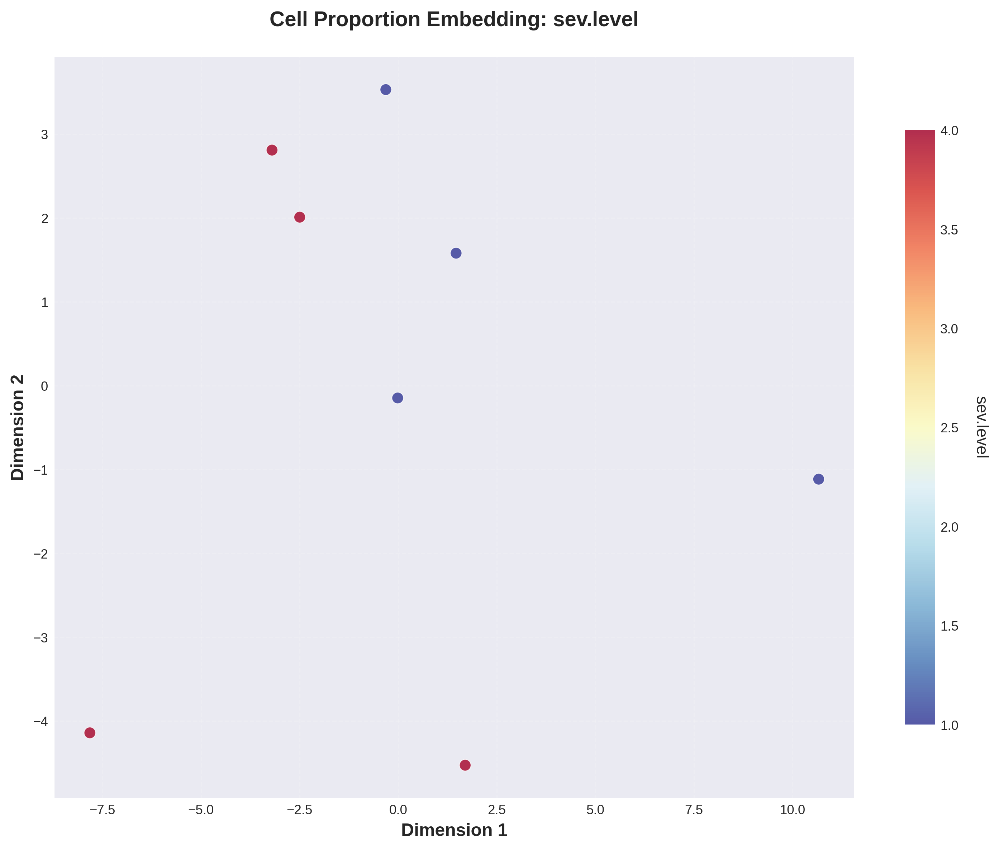
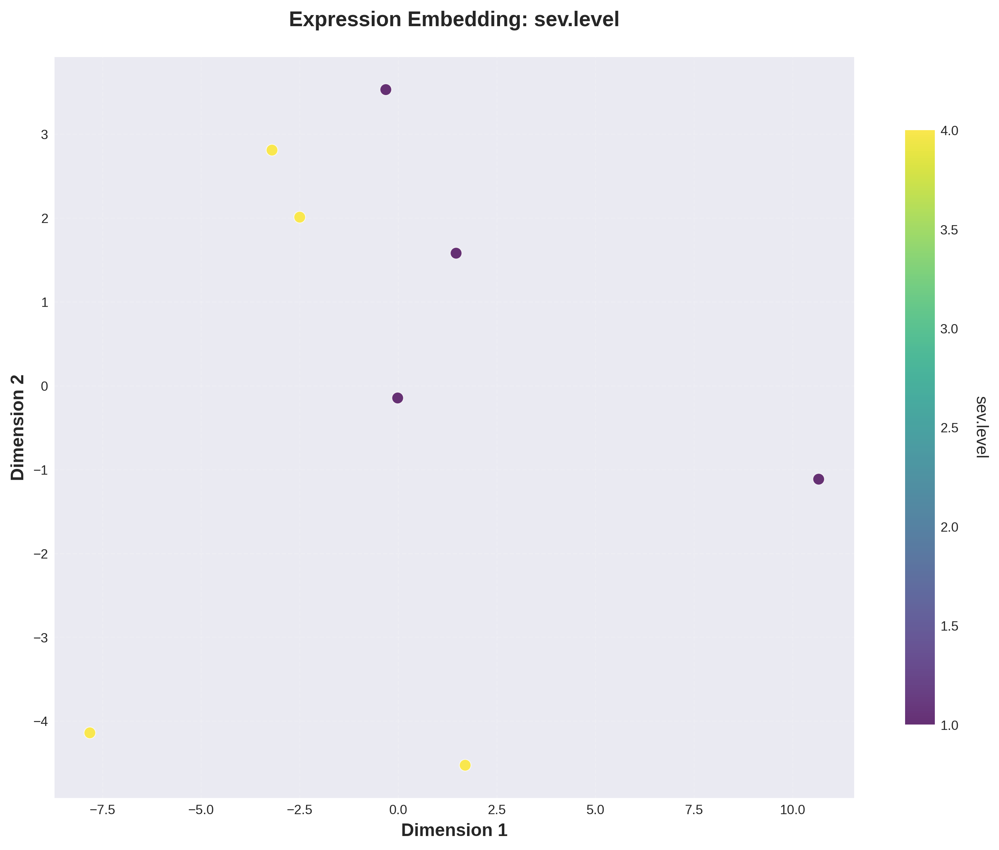

# General visualization

`visualization` bundles three diagnostic panels: a cell-type dendrogram, a per-grouping-column PCA of sample cell-type proportions, and a per-grouping-column UMAP of pseudobulk expression. Toggle whichever panels you want.

## Call

```python
from sampledisco.visualization.visualization_other import visualization

visualization(
    AnnData_cell=adata_cell,
    pseudobulk_anndata=pseudo_adata,
    output_dir="sampledisco_demo_output/rna/visualization",
    grouping_columns=["sev.level"],
    age_bin_size=None,
    age_column="age",
    plot_dendrogram_flag=True,
    plot_cell_type_proportions_pca_flag=True,
    plot_cell_type_expression_umap_flag=True,
)
```

## Output

**Writes** → `sampledisco_demo_output/rna/visualization/`:

- `cell_type_dendrogram.png` — hierarchical tree of cell types by pseudobulk expression.
- `proportion_embedding_{grouping_column}.png` — PCA on per-sample cell-type proportions, colored by the grouping.
- `expression_embedding_{grouping_column}.png` — UMAP on the expression embedding, colored by the grouping.

## Result


<div class="figure-caption">Example dendrogram output. Sub-trees reflect expression similarity between cell types in the pseudobulk.</div>


<div class="figure-caption">PCA on per-sample cell-type proportions, colored by the grouping.</div>


<div class="figure-caption">UMAP on the pseudobulk expression embedding, colored by the grouping.</div>

See the [API page](../../api/downstream/visualization.md) for the full parameter list.
