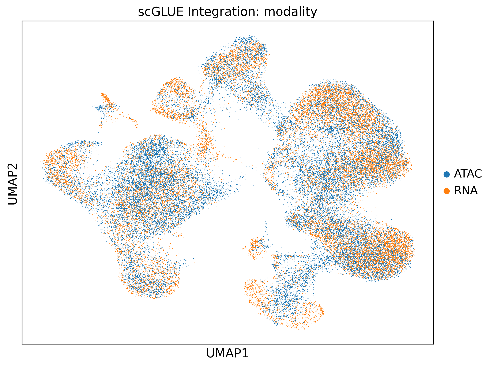
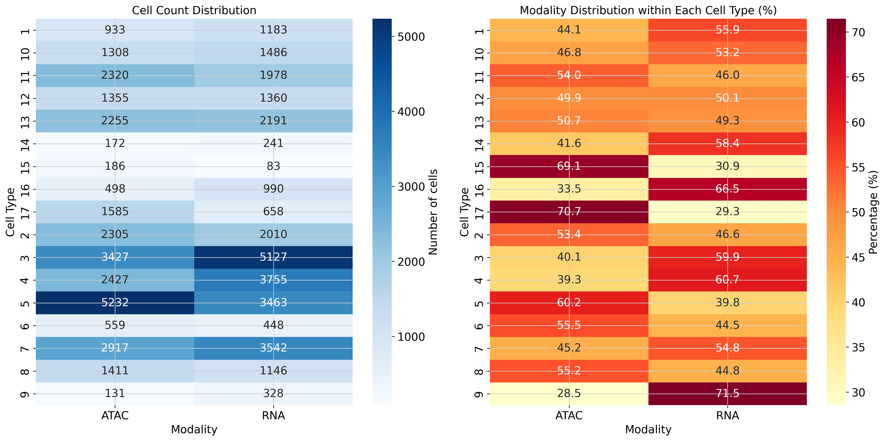
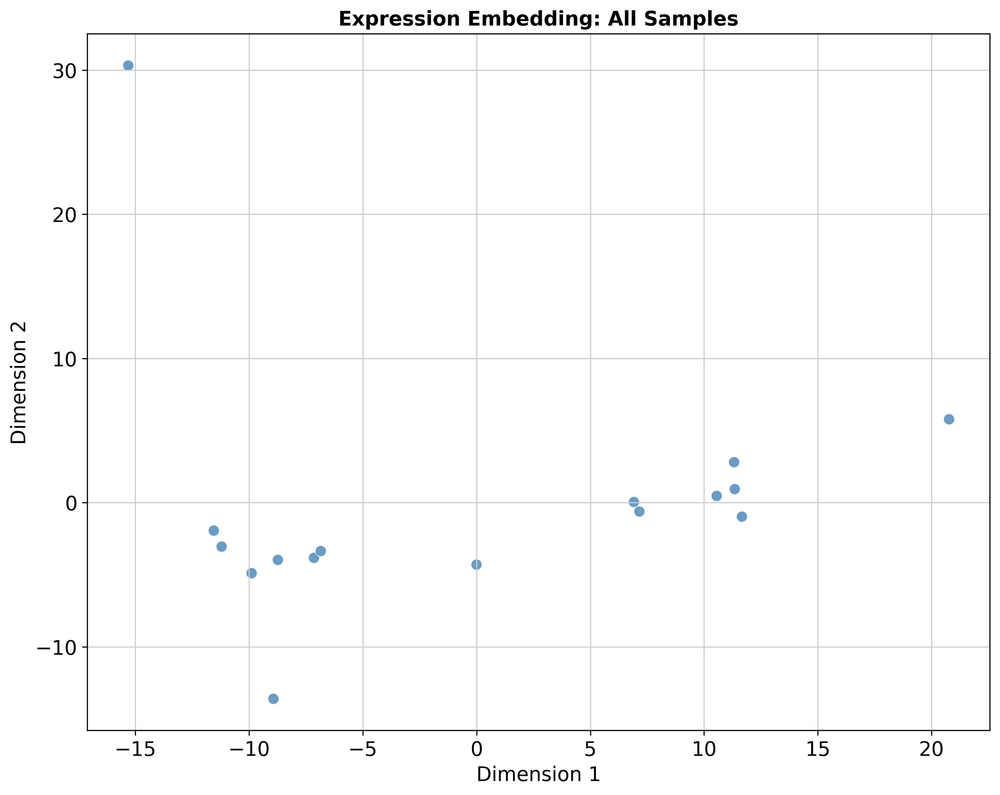
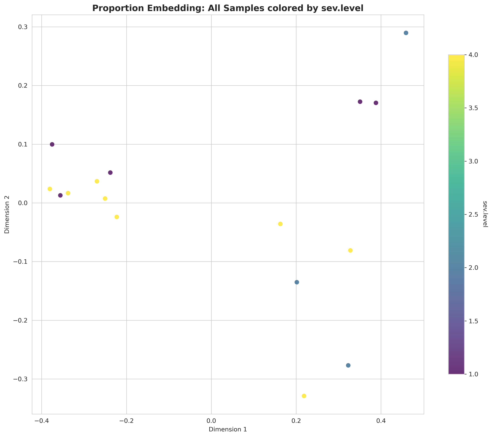
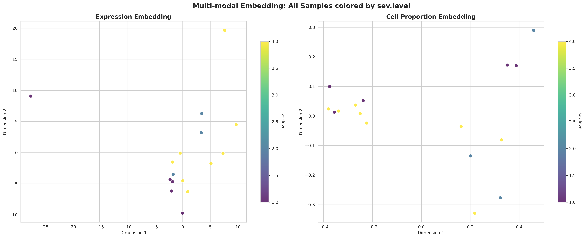
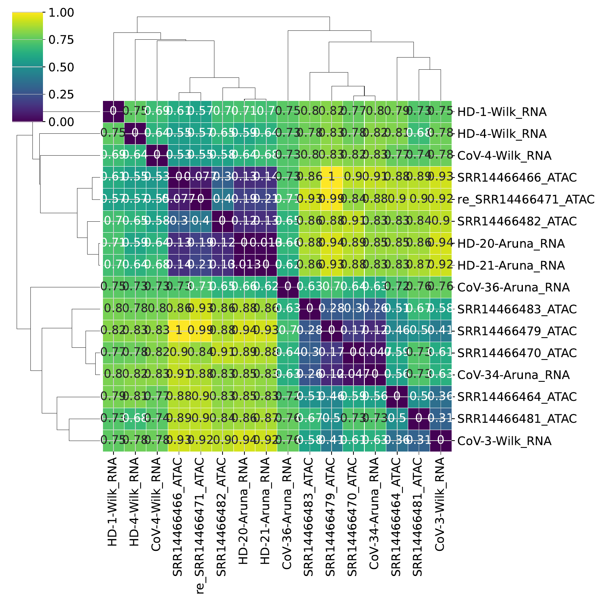
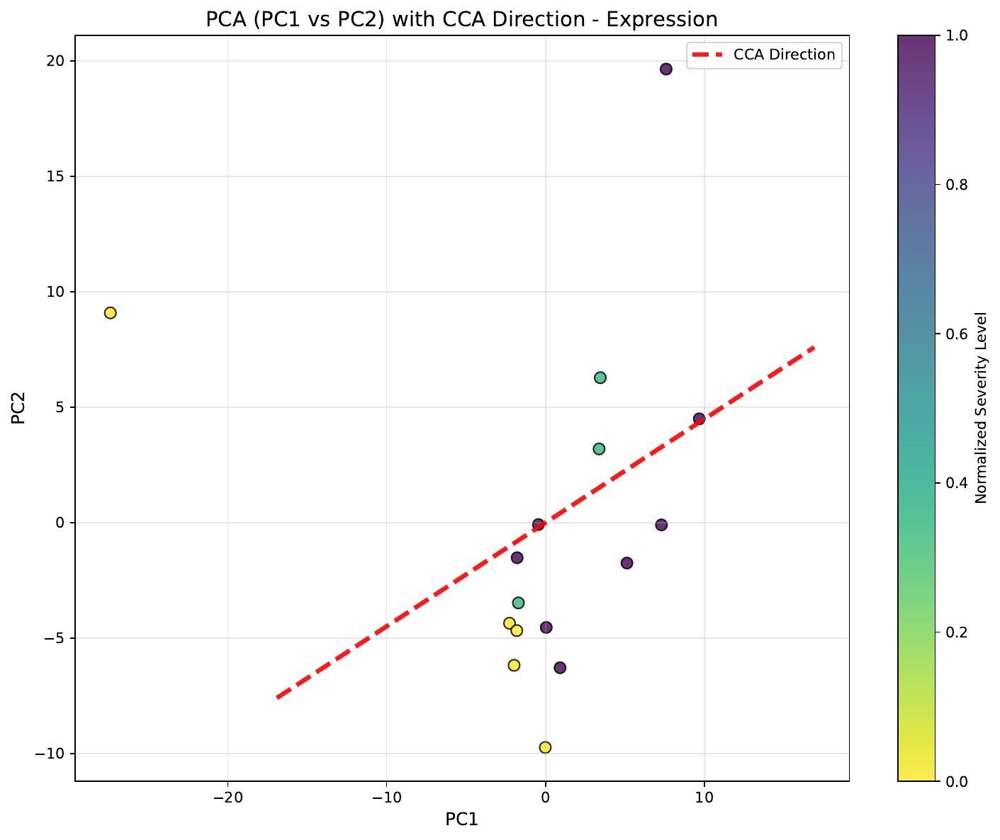
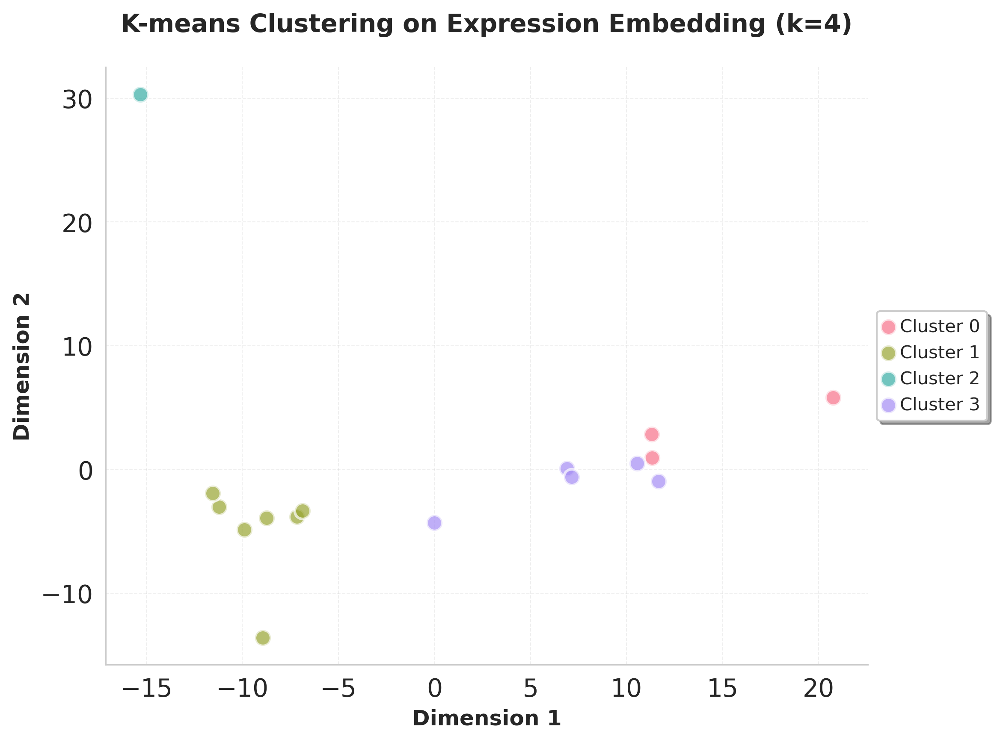

# Multi-omics pipeline tutorial

The multi-omics branch integrates unpaired (or paired) scRNA + scATAC data via [GLUE](https://www.nature.com/articles/s41587-022-01284-4), computes cell-type labels on the joint embedding, and then produces the same dual sample embedding (`X_DR_expression`, `X_DR_proportion`) as the single-modality pipelines. Downstream analyses (distance, trajectory, DGE, clustering) reuse the shared modules.

## Inputs

- `RNA.h5ad` and `ATAC.h5ad` — modality-tagged cell-level counts.
- Optional per-modality sample metadata CSVs.
- Optional `additional_hvg_file` — plain text list of genes forced into the HVG set (useful for anchoring known markers).

Output lands under `output_dir/multiomics/`.

## 1. GLUE integration

`multiomics_preparation` runs four sub-stages: RNA/ATAC preprocessing, GLUE adversarial training, gene-activity computation, and optional visualization. Each can be toggled via a flag.

```python
from genodistance.preparation import multiomics_preparation

multiomics_preparation(
    rna_file="/data/test_RNA.h5ad",
    atac_file="/data/test_ATAC.h5ad",
    rna_sample_meta_file=None,
    atac_sample_meta_file=None,
    additional_hvg_file="/data/unique_genes.txt",
    output_dir="/results/multiomics",
    # GLUE preprocessing
    ensembl_release=98,
    species="homo_sapiens",
    use_highly_variable=True,
    n_top_genes=2000,
    n_pca_comps=50,
    n_lsi_comps=50,
    gtf_by="gene_name",
    flavor="seurat_v3",
    generate_umap=False,
    rna_sample_column="sample",
    atac_sample_column="sample",
    # GLUE training
    consistency_threshold=0.05,
    treat_sample_as_batch=True,
    save_prefix="glue",
    # Gene activity
    k_neighbors=1,
    use_rep="X_glue",
    metric="cosine",
    use_gpu=True,
)
```

**Writes** → `/results/multiomics/integration/glue/` (trained model + integrated objects) and `/results/multiomics/preprocess/adata_sample.h5ad` with the joint embedding in `.obsm["X_glue"]`.



<div class="figure-caption">Step 1 — RNA and ATAC cells sharing the GLUE joint embedding. The right panel splits the modalities to confirm good mixing.</div>

## 2. Integration QC

After GLUE, `integrate_preprocess` performs additional QC on the merged object: min cells/genes filters, mito cutoff, and optional doublet detection (min-cells bumps to 30 automatically when doublet detection is on).

```python
from genodistance.preparation import integrate_preprocess

integrate_preprocess(
    output_dir="/results/multiomics",
    sample_column="sample",
    modality_col="modality",
    min_cells_sample=1,
    min_cell_gene=10,
    min_features=500,
    pct_mito_cutoff=20,
    exclude_genes=None,
    doublet=True,
    verbose=True,
)
```

**Writes** → updated `/results/multiomics/preprocess/adata_sample.h5ad`. No standalone figure; check the logs for kept/dropped cell counts.

## 3. Joint cell typing

`cell_types_multiomics_linux` clusters RNA cells with Leiden on `X_glue`, then transfers labels to ATAC via k-NN on the joint embedding.

```python
from genodistance.preparation import cell_types_multiomics_linux

adata_integrated = cell_types_multiomics_linux(
    adata=adata_integrated,                # loaded from preprocess/adata_sample.h5ad
    modality_column="modality",
    rna_modality_value="RNA",
    atac_modality_value="ATAC",
    cell_type_column="cell_type",
    cluster_resolution=0.8,
    use_rep="X_glue",
    num_PCs=50,
    k_neighbors=1,
    transfer_metric="cosine",
    compute_umap=True,
    save=True,
    output_dir="/results/multiomics",
)
```

**Writes** → `preprocess/adata_sample.h5ad` with a unified `cell_type` column, plus UMAPs.



<div class="figure-caption">Step 3 — Joint cell types on the GLUE embedding and a modality-balance check per cluster.</div>

## 4. Sample embedding

Identical to the single-modality version but also accepts a `modality_col` and `hvg_modality` so the pseudobulk picks HVGs from a chosen modality and includes the modality tag in batch correction.

```python
from genodistance.sample_embedding import calculate_multiomics_sample_embedding

pseudo_dict, pseudo_adata = calculate_multiomics_sample_embedding(
    adata=adata_integrated,
    sample_col="sample",
    celltype_col="cell_type",
    batch_col=None,
    modality_col="modality",
    hvg_modality="RNA",
    output_dir="/results/multiomics",
    sample_hvg_number=2000,
    n_expression_components=10,
    n_proportion_components=10,
    harmony_for_proportion=True,
    use_gpu=True,
    atac=False,
    save=True,
)
```

**Writes** → `/results/multiomics/pseudobulk/pseudobulk_sample.h5ad` with `X_DR_expression` and `X_DR_proportion` on the sample level.

## 5. Embedding visualization

`visualize_multimodal_embedding` produces side-by-side scatter plots of the two embeddings with optional coloring by metadata.

```python
from genodistance.visualization import visualize_multimodal_embedding

visualize_multimodal_embedding(
    adata=pseudo_adata,
    modality_col="modality",
    color_col=None,
    target_modality="ATAC",
    expression_key="X_DR_expression",
    proportion_key="X_DR_proportion",
    visualization_grouping_column=["sev.level"],
    figsize=(20, 8),
    point_size=60,
    alpha=0.8,
    colormap="viridis",
    output_dir="/results/multiomics/visualization",
    show_sample_names=False,
    show_default=True,
)
```

**Writes** → `/results/multiomics/visualization/`.



<div class="figure-caption">Step 5 — Default visualization: every sample placed in the two sample-level embeddings.</div>



<div class="figure-caption">Same plots, points colored by the severity phenotype supplied through `visualization_grouping_column`.</div>


<div class="figure-caption">Combined panel used for figures: both embeddings with a shared colorbar.</div>

## 6. Downstream

The distance, trajectory, DGE, and clustering modules are the same as single modality — feed them `pseudo_adata` from step 4. Example for sample distance:

```python
from genodistance.sample_distance import sample_distance

sample_distance(
    adata=pseudo_adata,
    output_dir="/results/multiomics",
    method="cosine",
    data_type="RNA",                   # DR-priority hint; not modality-restrictive
    grouping_columns=["sev.level"],
)
```


<div class="figure-caption">Step 6 — Multi-omics sample distance on the joint expression embedding.</div>

For CCA, TSCAN, K-means, and TSCAN-colored trajectories, see the [Downstream analysis tutorial](downstream.md). Representative outputs from this dataset:





## Advanced: optimal-resolution search

Setting `multiomics_find_optimal_resolution: true` enables a CCA-guided two-pass search (`find_optimal_cell_resolution_multiomics_linux`) that sweeps Leiden resolutions and picks the value maximizing CCA correlation with your phenotype. See the [API page](../api/multiomics/find_optimal_cell_resolution_multiomics_linux.md) — the result is written back into the pseudobulk via `replace_optimal_dimension_reduction`.
