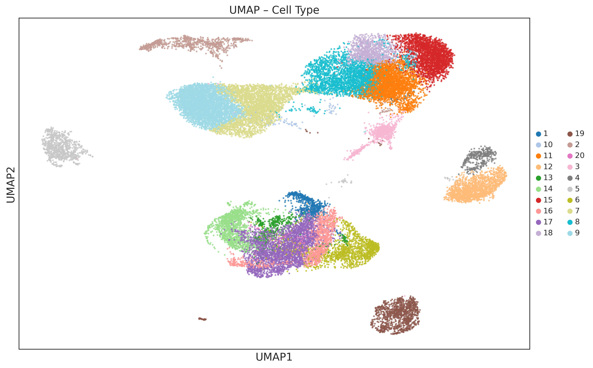
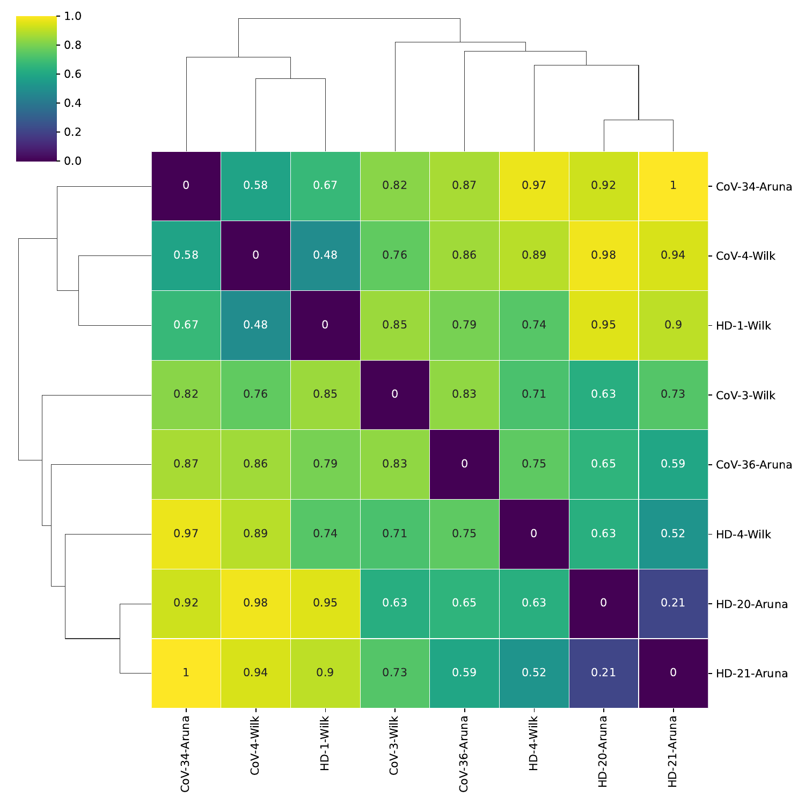
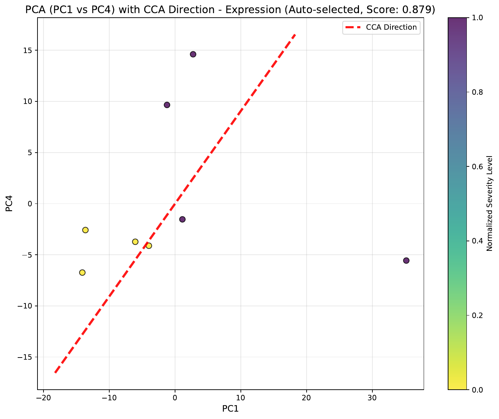
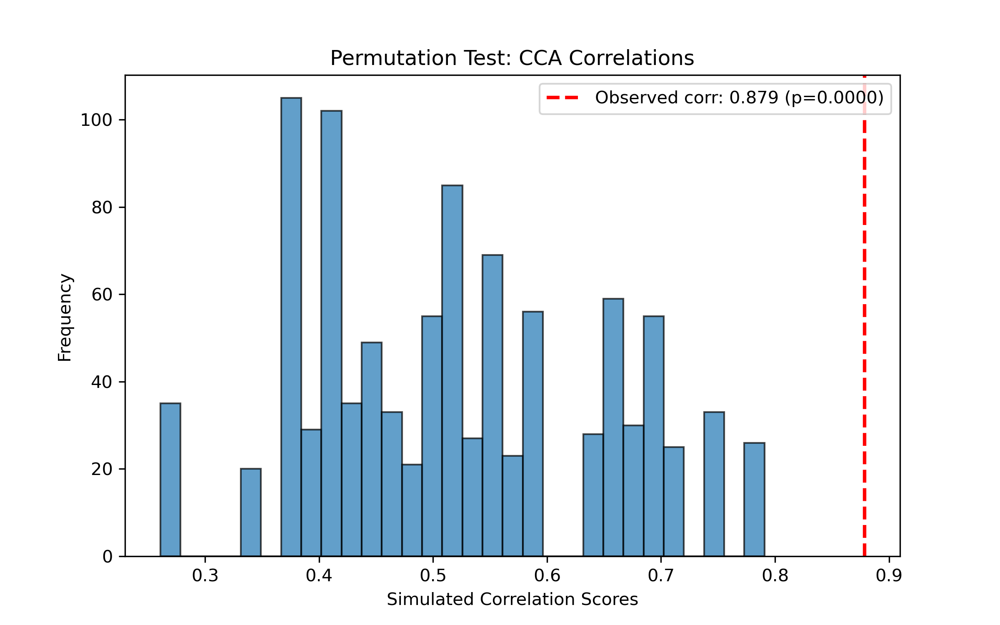
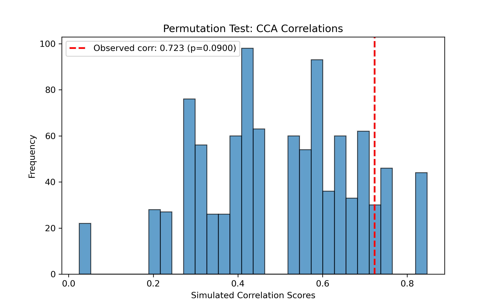
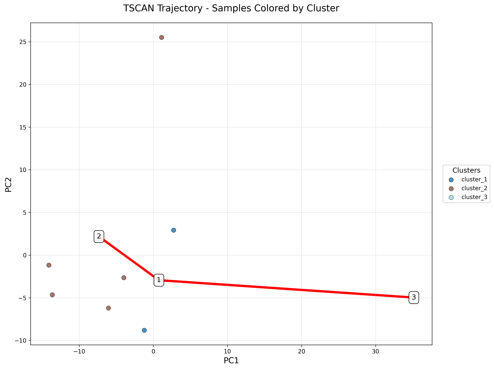
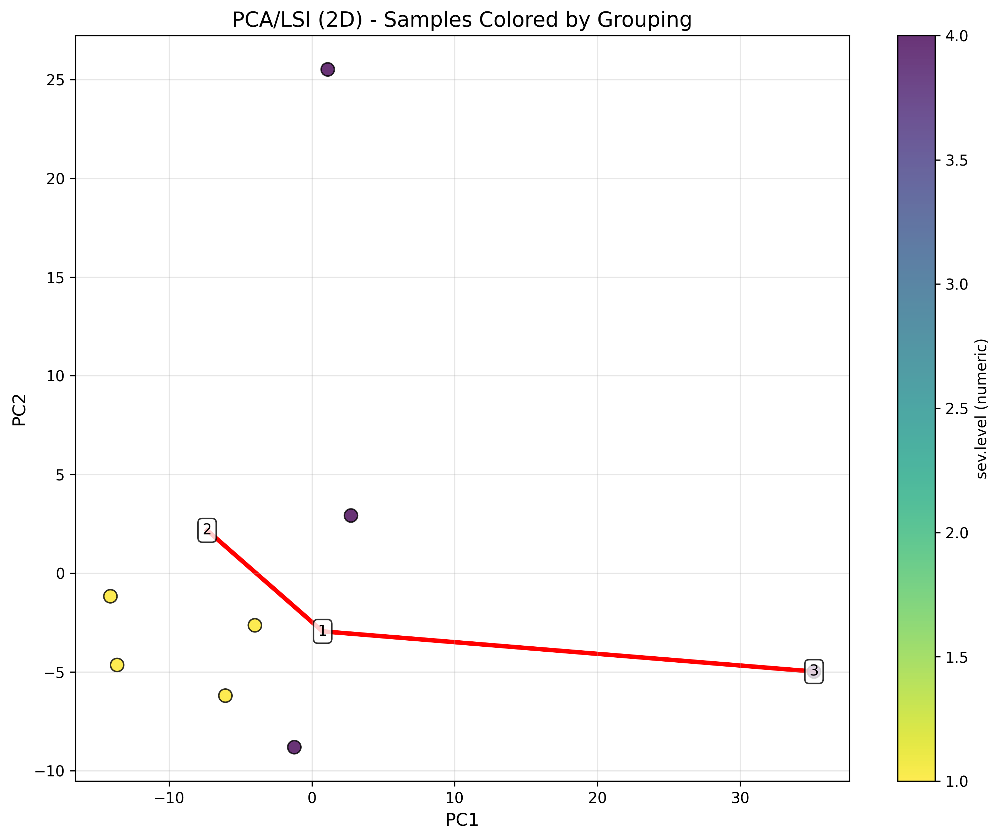
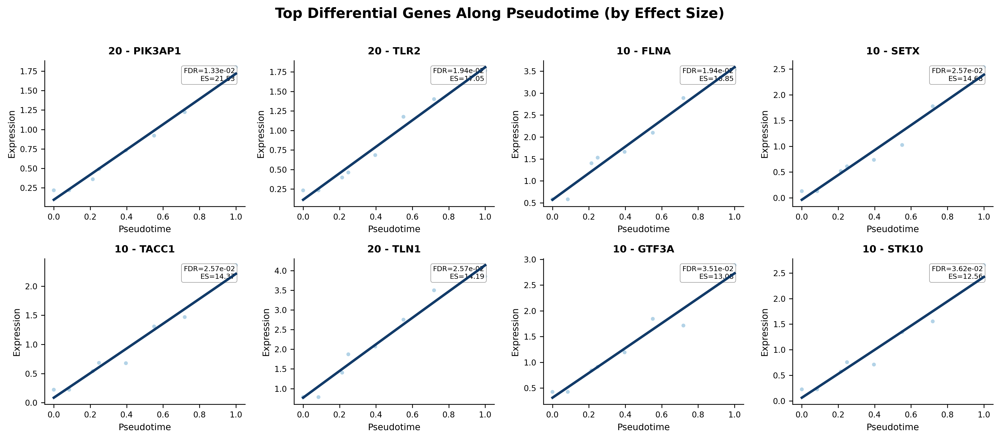
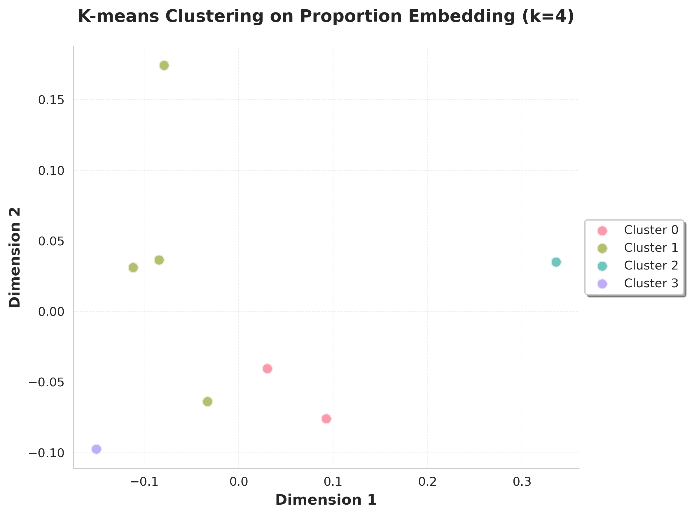

# RNA pipeline tutorial

This tutorial walks through an end-to-end scRNA-seq analysis using SampleDisc function-by-function. Every step shows the call you would make from a notebook, the files it writes, and the figure you should expect. Parameter values follow the canonical [`config_covid_rna.yaml`](https://github.com/).

!!! note "Imports"
    The code below assumes `genodistance` is installed. Until the package is published, use the equivalent absolute imports from `code/` (e.g. `from preparation.rna_preprocess_gpu import preprocess_linux`).

## Inputs

- `RNA.h5ad` — cell-level raw counts; `.obs` must carry a sample column (default `"sample"`).
- `sample_meta.csv` — one row per sample keyed by `sample`, with phenotype columns such as `sev.level`, `age`, `batch`.

Output lands under `output_dir/rna/`.

## 1. Preprocessing

Read counts, merge metadata, QC-filter cells and genes, select HVGs, compute PCA, and run Harmony integration. Two AnnData objects come out: one for clustering (batch-corrected) and one for sample-level differential analysis (minimally processed, raw counts preserved).

```python
from genodistance.preparation import preprocess_linux

adata_cluster, adata_sample = preprocess_linux(
    h5ad_path="/data/test_RNA.h5ad",
    sample_meta_path="/data/sample_meta.csv",
    output_dir="/results/rna",
    sample_column="sample",
    cell_level_batch_key=None,
    min_cells=500,
    min_genes=500,
    pct_mito_cutoff=20,
    num_cell_hvgs=2000,
    cell_embedding_num_PCs=20,
    num_harmony_iterations=30,
    verbose=True,
)
```

**Writes** → `/results/rna/preprocess/adata_cell.h5ad`, `/results/rna/preprocess/adata_sample.h5ad`.

## 2. Cell-type clustering

Leiden clustering on the Harmony-integrated embedding, with optional UMAP. The resulting labels are written to `adata_cluster.obs["cell_type"]` and propagated to `adata_sample`.

```python
from genodistance.preparation import cell_types_linux

adata_cluster, adata_sample = cell_types_linux(
    anndata_cell=adata_cluster,
    anndata_sample=adata_sample,
    leiden_cluster_resolution=0.99,
    n_target_clusters=None,
    umap=True,
    save=True,
    output_dir="/results/rna",
    verbose=True,
)
```

**Writes** → updated h5ad files and a UMAP PNG under `preprocess/`.


<div class="figure-caption">Step 2 — UMAP of single cells colored by Leiden cell type assignments.</div>

## 3. Sample embedding

Aggregate single cells into a pseudobulk AnnData and compute two dimension reductions:

- `X_DR_expression` — HVG-based PCA of cell-type-pooled expression (Harmony-corrected if a batch column is supplied).
- `X_DR_proportion` — PCA of per-sample cell-type proportions.

```python
from genodistance.sample_embedding import calculate_sample_embedding

pseudo_dict, pseudo_adata = calculate_sample_embedding(
    adata=adata_sample,
    sample_col="sample",
    celltype_col="cell_type",
    batch_col=None,
    output_dir="/results/rna",
    sample_hvg_number=2000,
    n_expression_components=10,
    n_proportion_components=10,
    harmony_for_proportion=True,
    use_gpu=True,
    atac=False,
    save=True,
)
```

**Writes** → `/results/rna/pseudobulk/pseudobulk_sample.h5ad` (with `X_DR_expression` and `X_DR_proportion` in `.obsm`) plus CSV exports under `embeddings/`.

## 4. Sample distance

Pairwise distances between sample embeddings. Each requested method produces its own subdirectory with a distance matrix and a heatmap.

```python
from genodistance.sample_distance import sample_distance

for method in ["cosine", "correlation"]:
    sample_distance(
        adata=pseudo_adata,
        output_dir="/results/rna",
        method=method,
        data_type="RNA",
        grouping_columns=["sev.level"],
    )
```

**Writes** → `/results/rna/Sample_distance/{cosine,correlation}/` with `*_DR_heatmap_*.pdf` and the underlying CSV.



<div class="figure-caption">Step 4 — Cosine-distance heatmaps on the expression (top) and proportion (bottom) sample embeddings.</div>

## 5. Supervised trajectory (CCA)

If you have a phenotype variable (severity, pseudotime truth, age bin), `CCA_Call` projects both embeddings onto the axis most correlated with it and assigns a pseudotime to every sample.

```python
from genodistance.sample_trajectory import CCA_Call, cca_pvalue_test

results = CCA_Call(
    adata=pseudo_adata,
    output_dir="/results/rna",
    trajectory_col="sev.level",
    n_components=10,
    verbose=True,
)

# Permutation test on the correlation
for column in ["X_DR_expression", "X_DR_proportion"]:
    cca_pvalue_test(
        pseudo_adata=pseudo_adata,
        column=column,
        input_correlation=results[column]["score"],
        output_directory="/results/rna",
        num_simulations=1000,
        trajectory_col="sev.level",
    )
```

**Writes** → `/results/rna/CCA/pca_10d_cca_{expression,proportion}.pdf` and `/results/rna/CCA_test/cca_pvalue_distribution_*.png`.



<div class="figure-caption">Step 5 — CCA projection of samples onto the severity axis. Each point is a sample.</div>



<div class="figure-caption">Null distribution of CCA correlations from 1,000 label permutations with the observed value marked.</div>

## 6. Unsupervised trajectory (TSCAN)

If you do not have a supervising phenotype, TSCAN clusters samples with a BIC-selected GMM, builds a minimum spanning tree on cluster centroids, and orders samples along the principal path.

```python
from genodistance.sample_trajectory import TSCAN

tscan_expr = TSCAN(
    AnnData_sample=pseudo_adata,
    column="X_DR_expression",
    n_clusters=None,       # BIC picks automatically
    output_dir="/results/rna",
    grouping_columns=["sev.level"],
    origin=None,
)
```

**Writes** → `/results/rna/TSCAN/` with cluster-colored and grouping-colored trajectory plots.



<div class="figure-caption">Step 6 — TSCAN trajectory on the expression embedding: left, points colored by inferred cluster; right, colored by severity level.</div>

## 7. Trajectory differential gene analysis

Fit a GAM to each gene against pseudotime from step 5 or 6, then rank by effect size and FDR.

```python
from genodistance.sample_trajectory import run_trajectory_gam_differential_gene_analysis

dge = run_trajectory_gam_differential_gene_analysis(
    pseudobulk_adata=pseudo_adata,
    pseudotime_source=results["X_DR_expression"]["pseudotime"],
    sample_col="sample",
    pseudotime_col="pseudotime",
    fdr_threshold=0.05,
    effect_size_threshold=1.0,
    top_n_genes=100,
    num_splines=5,
    spline_order=2,
    output_dir="/results/rna/trajectoryDEG/expression",
)
```

**Writes** → `trajectoryDEG/expression/`:

- `pseudoDEGs.csv` — per-gene effect size, p-value, FDR, rank.
- `visualizations/tde_heatmap.png` — top genes × pseudotime-ordered samples.
- `visualizations/gene_curves.png` — GAM fits for top genes.



<div class="figure-caption">Step 7 — Top trajectory-differential genes (heatmap) and their GAM-smoothed expression curves along pseudotime.</div>

## 8. Sample clustering

K-means on each embedding gives two sample-to-cluster mappings.

```python
from genodistance import cluster

expr_clusters, prop_clusters = cluster(
    pseudobulk_adata=pseudo_adata,
    output_dir="/results/rna",
    number_of_clusters=4,
    use_expression=True,
    use_proportion=True,
    random_state=0,
)
```

**Writes** → `/results/rna/sample_cluster/kmeans_clusters_{expression,proportion}.csv` and the two embedding scatter PNGs below.



<div class="figure-caption">Step 8 — Sample clusters drawn in the first two PCs of each embedding.</div>

## Continue

Proportion testing, RAISIN-based cluster DGE, and general visualization are identical across modalities. See the [Downstream analysis tutorial](downstream.md) for those steps.
