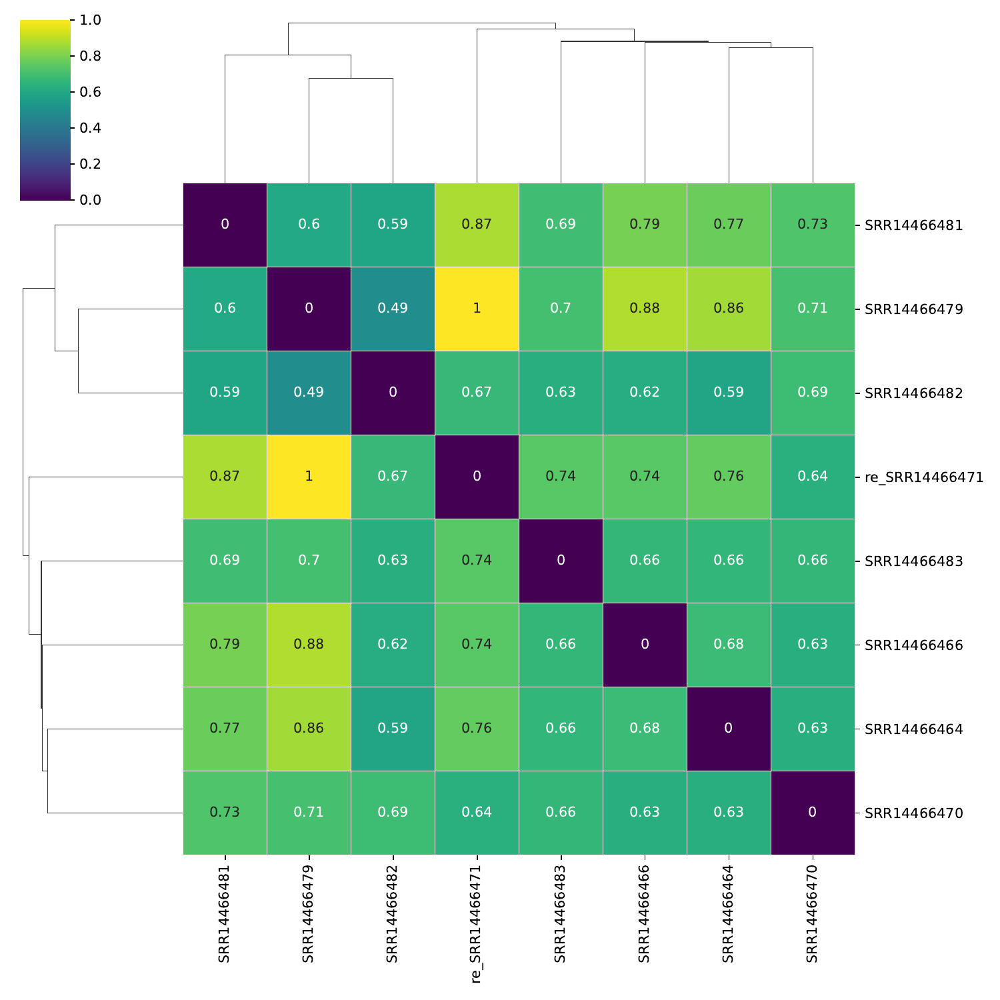
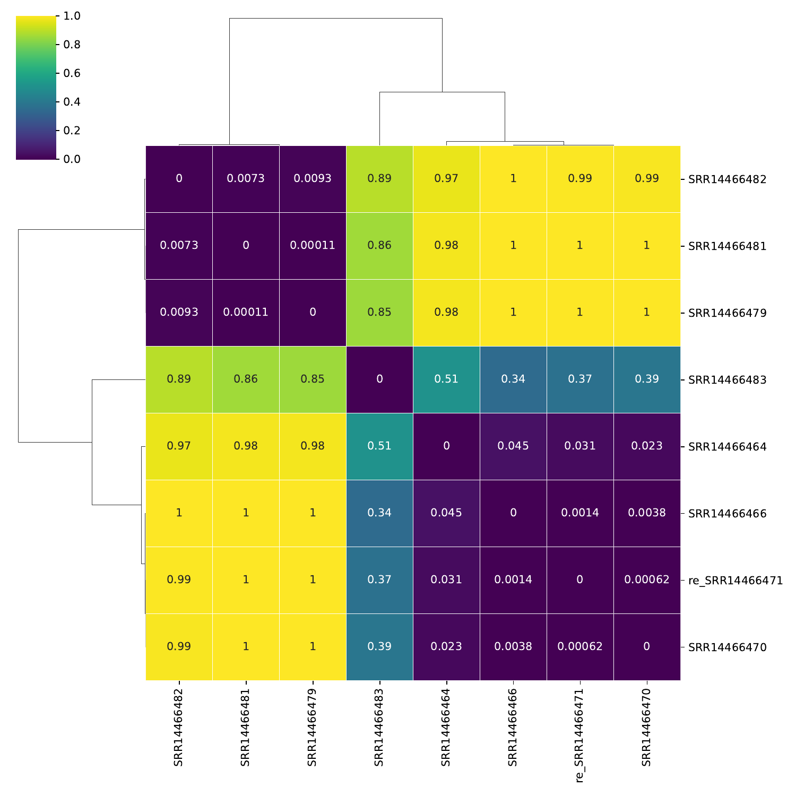
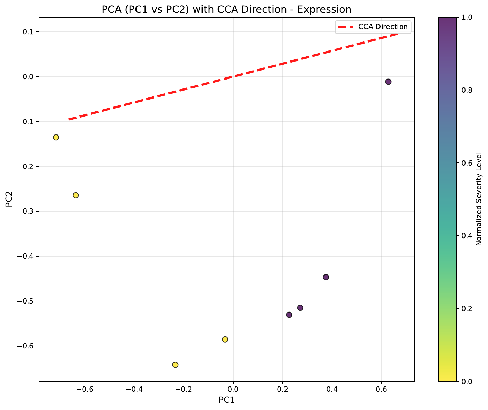
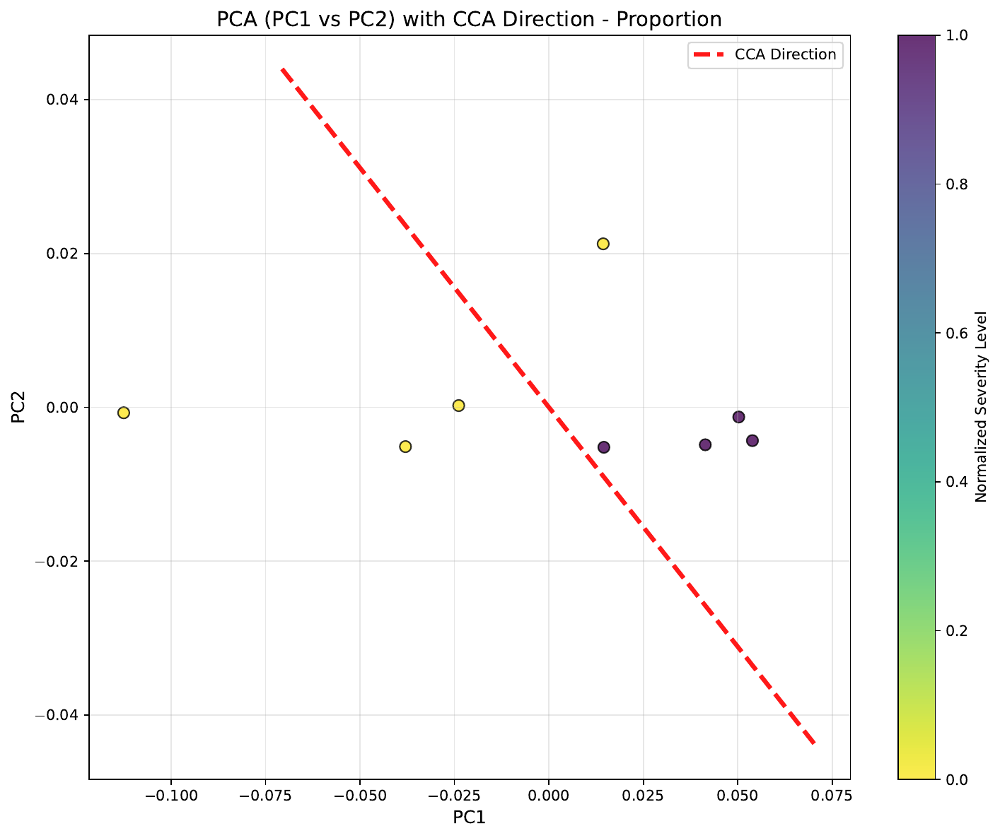
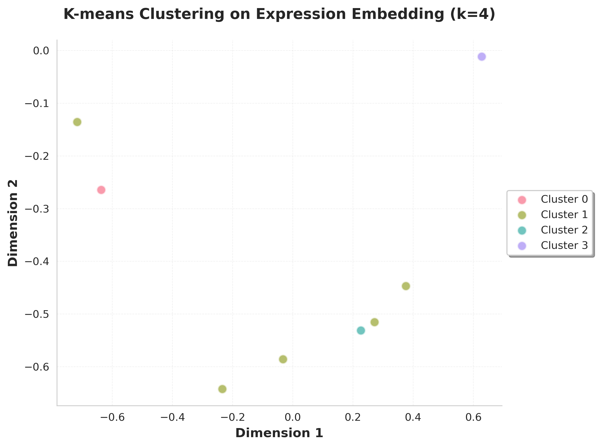
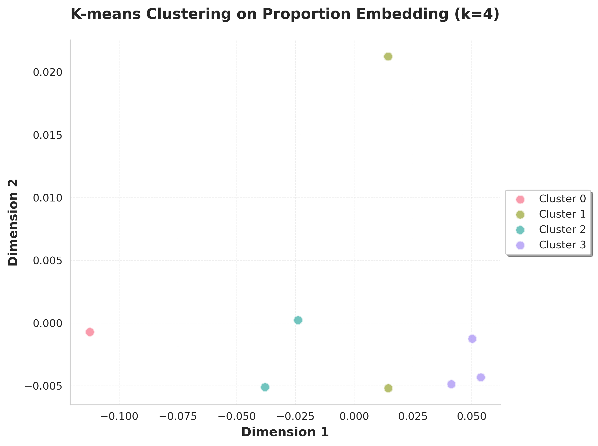
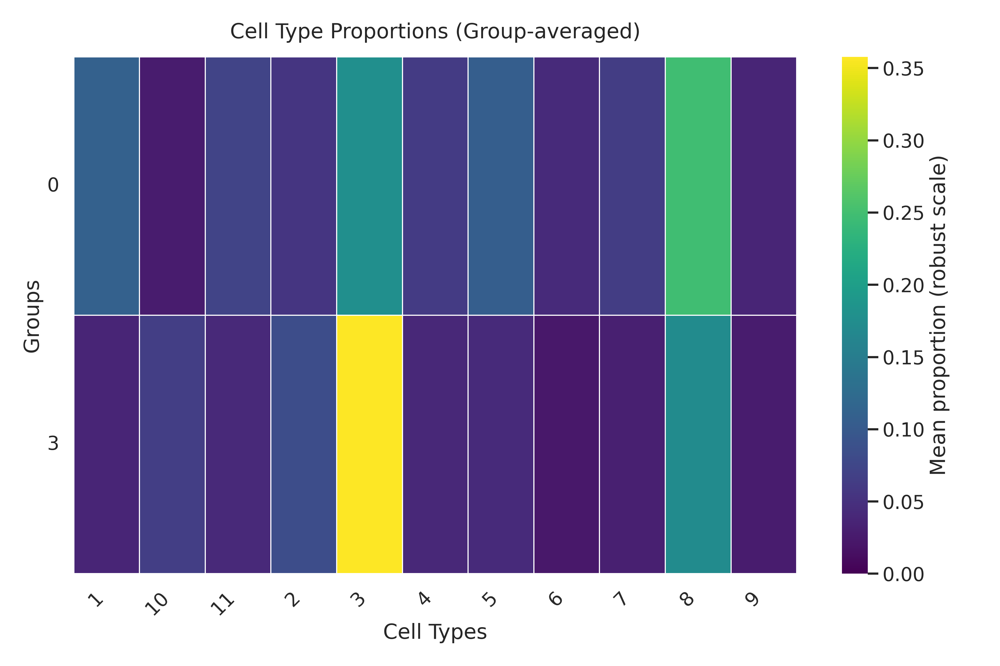

# ATAC Pipeline Tutorial

This tutorial follows the ATAC branch of `wrapper(...)`.

## 1) Preprocessing

Controlled by:

- `atac_preprocessing`
- `atac_min_features`, `atac_max_features`, `atac_min_cells_per_sample`
- `atac_doublet_detection`, `atac_num_cell_hvfs`
- `atac_tfidf_scale_factor`, `atac_log_transform`, `atac_drop_first_lsi`

Main API: `preprocess()` / `preprocess_linux()`

## 2) Cell type clustering

Controlled by:

- `atac_cell_type_cluster`
- `atac_leiden_cluster_resolution`
- `atac_existing_cell_types`
- `atac_n_target_cell_clusters`

Main API: `cell_types()`

## 3) Sample embedding

Controlled by:

- `atac_derive_sample_embedding`
- `atac_sample_hvg_number`
- `atac_sample_embedding_dimension`
- `atac_harmony_for_proportion`

Main API: `calculate_sample_embedding(..., atac=True)`

## 4) Sample distance

Controlled by:

- `atac_sample_distance_calculation`
- `atac_sample_distance_methods`
- `atac_grouping_columns`

Main API: `sample_distance()`

## 5) Trajectory analysis

Controlled by:

- `atac_trajectory_analysis`
- `atac_trajectory_supervised`
- `atac_n_cca_pcs`
- `atac_trajectory_col`

Main API: `CCA_Call()` or `TSCAN()`

## 6) Sample clustering

Controlled by:

- `atac_sample_cluster`
- `atac_cluster_number`

Main API: `cluster()`

## 7) Proportion test

Controlled by:

- `atac_proportion_test`

Main API: `proportion_test()`

## 8) Notes

- ATAC uses TF-IDF and LSI style representation before downstream analysis.
- Do not over-tighten feature cutoffs in preprocessing; it can remove many cells.
- For full shared downstream details, see [Downstream Analysis](tutorial_downstream.md).
