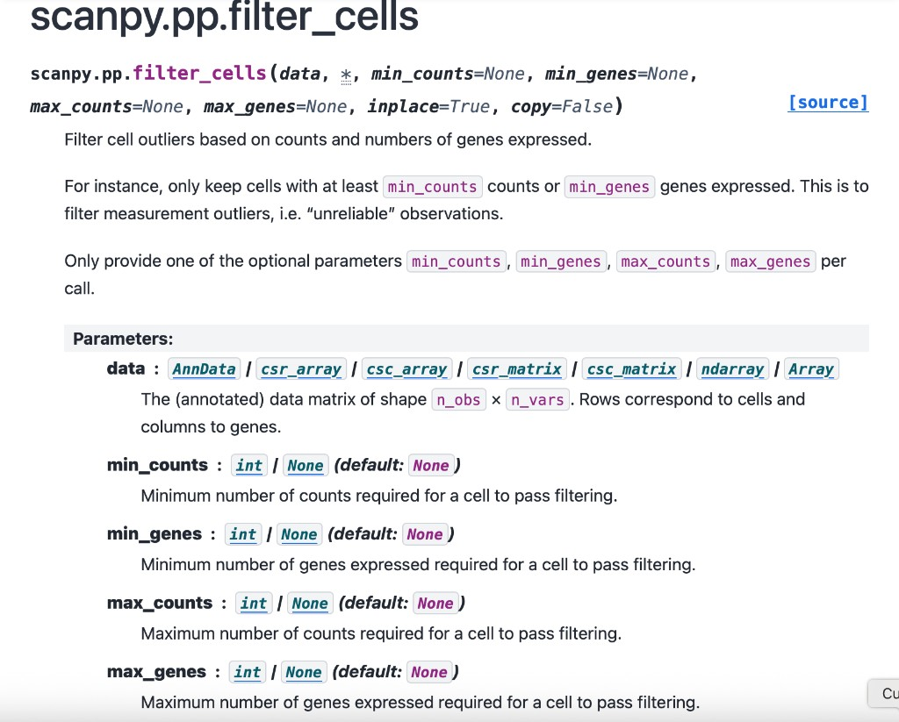

# Tutorial 2: scATAC-seq Analysis

The ATAC workflow mirrors the RNA pipeline but uses ATAC-aware preprocessing and dimensionality reduction before sample embedding.

## What changes for ATAC

- QC relies on feature counts rather than gene counts.
- The sample embedding layer can switch to TF-IDF and LSI style features.
- ATAC-specific parameters control feature filtering, doublet detection, and LSI behavior.

## Key command

```bash
python /users/hjiang/GenoDistance/code/SampleDisc.py -m complex \
  --config path/to/atac_config.yaml
```

## ATAC-specific parameters

| Category | Parameters |
| --- | --- |
| Filtering | `atac_min_cells`, `atac_min_features`, `atac_max_features`, `atac_min_cells_per_sample` |
| Preprocessing | `atac_doublet_detection`, `atac_num_cell_hvfs`, `atac_tfidf_scale_factor` |
| Latent space | `atac_cell_embedding_num_pcs`, `atac_drop_first_lsi`, `atac_cell_embedding_column` |
| Sample embedding | `atac_sample_hvg_number`, `atac_sample_embedding_dimension` |

## Representative outputs

### Sample embedding coordinates

The copied ATAC sample embedding file stores LSI coordinates per sample:

| Sample | LSI1 | LSI2 | LSI3 |
| --- | ---: | ---: | ---: |
| `SRR14466462` | 0.5133 | -0.2725 | -0.0907 |
| `SRR14466463` | 0.2937 | -0.4944 | 0.3187 |
| `SRR14466464` | 0.2870 | -0.2458 | -0.7417 |
| `SRR14466470` | 0.3955 | 0.0582 | 0.5404 |

Full artifact: [sample_expression_embedding.csv](../resource/data/atac/sample_expression_embedding.csv)

### Sample clusters

- [kmeans_clusters_expression.csv](../resource/data/atac/kmeans_clusters_expression.csv)

### Resolution summary

- [all_resolution_results_expression.csv](../resource/data/atac/all_resolution_results_expression.csv)

### Scanpy-style documentation reference

This copied screenshot is included as a design anchor for detailed parameter documentation pages.



## Interpretation guidance

!!! note
    `calculate_sample_embedding(...)` documents that the ATAC path uses TF-IDF/LSI rather than the normalization and PCA path used in RNA mode.

!!! warning
    ATAC preprocessing is sensitive to feature-count thresholds. Overly strict `atac_min_features` or `atac_max_features` settings can remove large fractions of cells before sample embedding is constructed.

## Runtime estimate

- Preprocessed ATAC matrices to sample embedding: **tens of minutes** on moderate datasets.
- Full raw-data ATAC preprocessing plus downstream analysis: **tens of minutes to a few hours**, depending on matrix size and doublet detection.

## Related references

- [Overview: Using Config Files](config_overview.md)
- [Preparation API](../api/preparation.md)
- [Sample Embedding API](../api/embedding.md)
