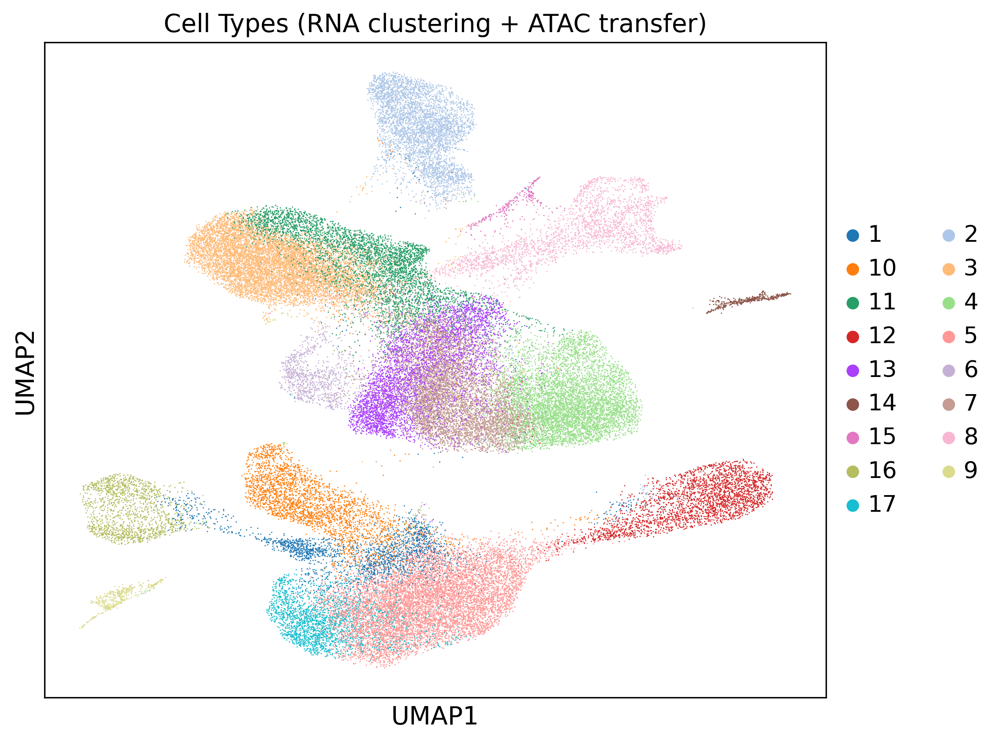
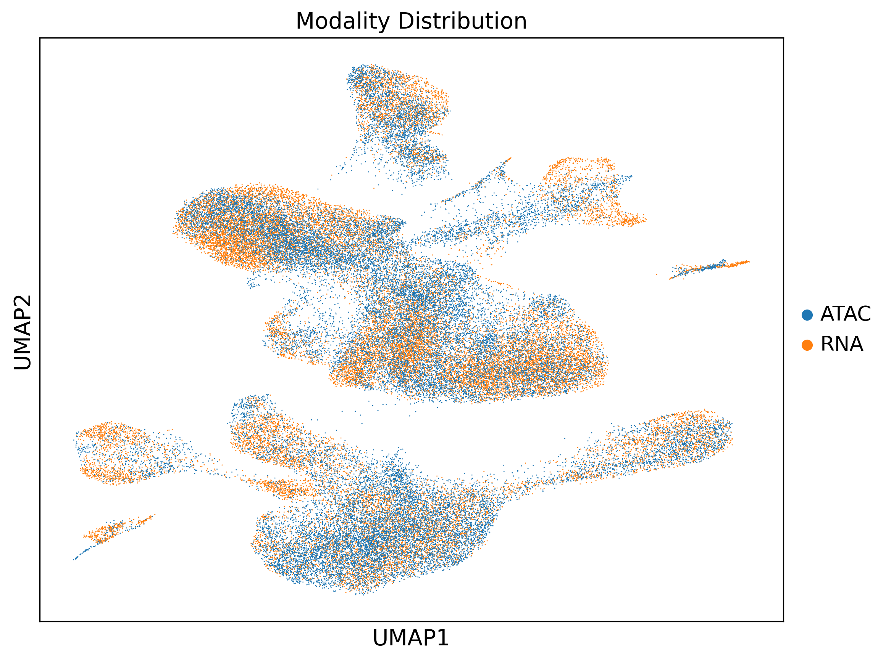
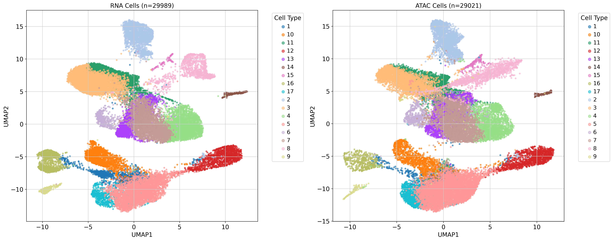
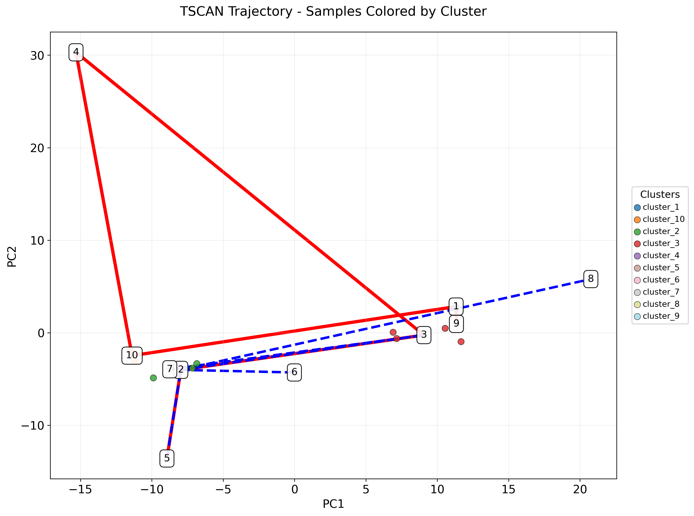
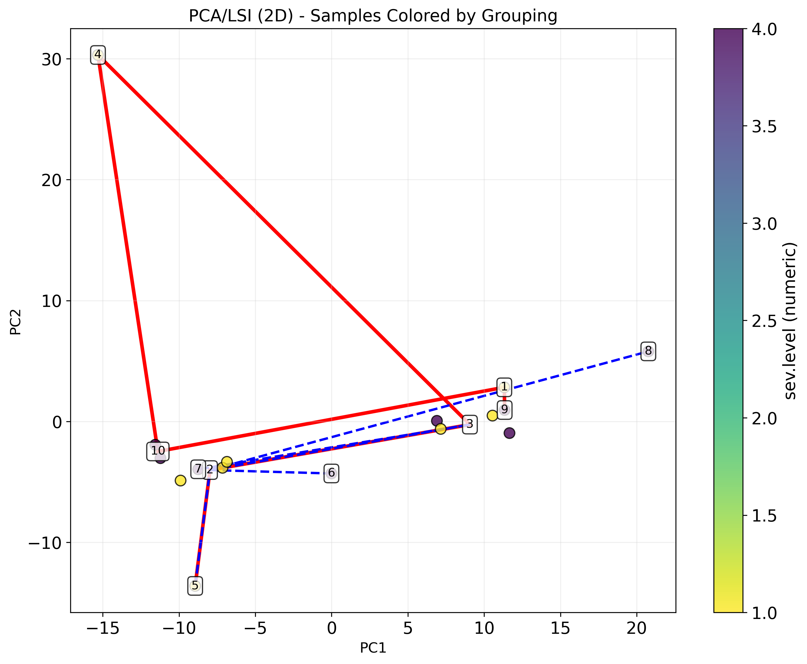
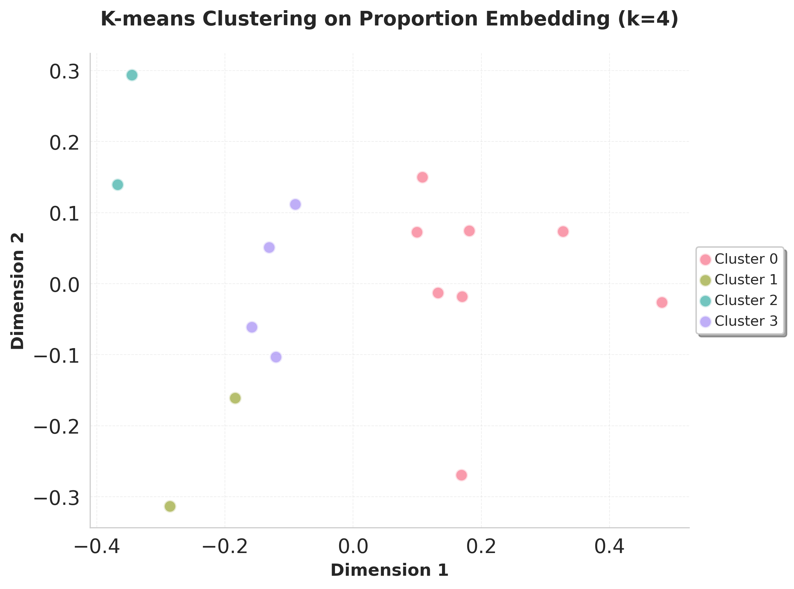
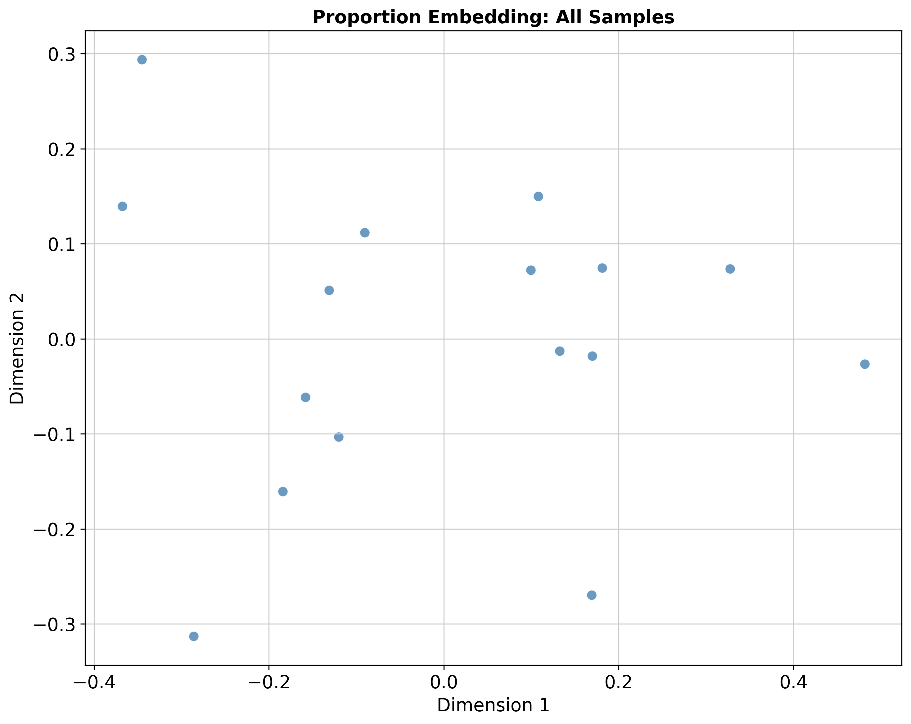
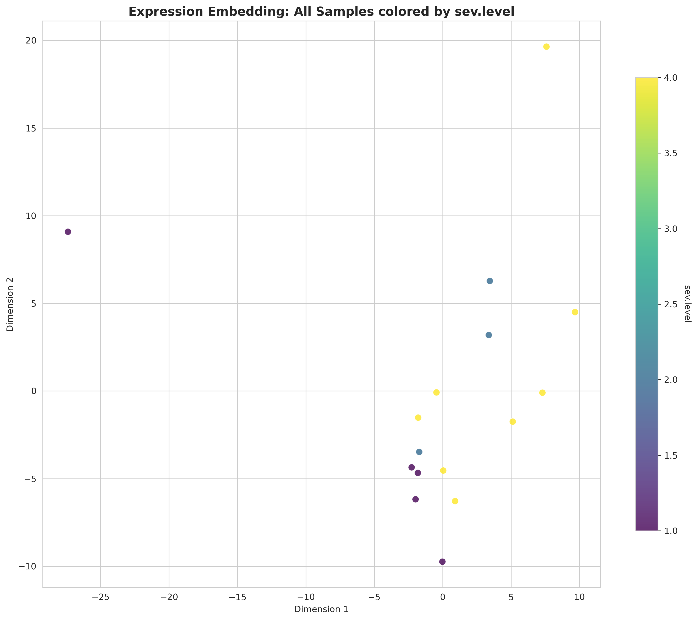

# Multi-omics Pipeline Tutorial

This tutorial follows the `multiomics_wrapper(...)` branch and then shared downstream analysis.

## 1) GLUE integration

Controlled by:

- `multiomics_integration`
- `multiomics_run_glue_preprocessing`
- `multiomics_run_glue_training`
- `multiomics_run_glue_gene_activity`
- `multiomics_run_glue_visualization`

Main API: `multiomics_preparation()`

## 2) Integration preprocessing

Controlled by:

- `multiomics_integration_preprocessing`
- `multiomics_min_cells_sample`
- `multiomics_min_cell_gene`
- `multiomics_min_features`
- `multiomics_pct_mito_cutoff`

Main API: `integrate_preprocess()`

## 3) Cell type clustering on integrated data

Controlled by:

- `multiomics_cell_type_cluster`
- `multiomics_cluster_resolution`
- `multiomics_use_rep_celltype`
- `multiomics_n_target_clusters`
- `multiomics_generate_umap_celltype`

Main API: `cell_types_multiomics()` / `cell_types_multiomics_linux()`

## 4) Sample embedding

Controlled by:

- `multiomics_dimensionality_reduction`
- `multiomics_sample_hvg_number`
- `multiomics_n_expression_components`
- `multiomics_n_proportion_components`
- `multiomics_harmony_for_proportion`

Main API: `calculate_multiomics_sample_embedding()`

## 5) Shared downstream modules

Controlled by:

- `multiomics_sample_distance_calculation`
- `multiomics_trajectory_analysis`
- `multiomics_trajectory_dge`
- `multiomics_sample_cluster`
- `multiomics_proportion_test`
- `multiomics_cluster_dge`

Main API: `downstream_analysis()`

## 6) Multi-omics embedding visualization

This is specific to the multi-omics branch.

Controlled by:

- `multiomics_visualize_embedding`
- `multiomics_color_col`
- `multiomics_visualization_grouping_column`
- `multiomics_target_modality`
- `multiomics_expression_key`
- `multiomics_proportion_key`

Main API: `visualize_multimodal_embedding()`

## Notes

`multiomics_find_optimal_resolution` is intentionally not covered in this tutorial page. It is documented in the Multi-omics API section.
