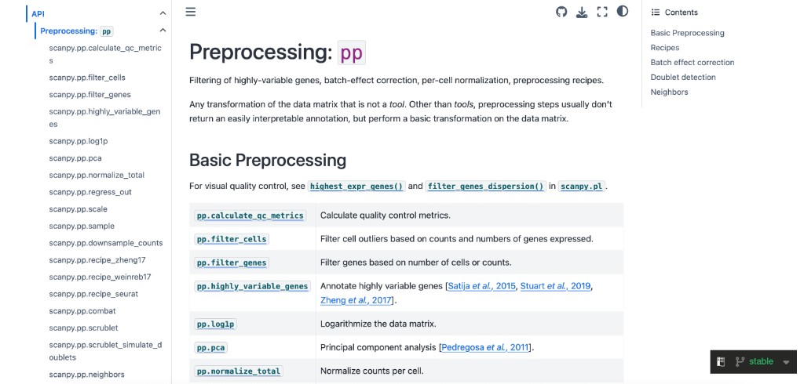

# Tutorial 1: scRNA-seq Analysis

This tutorial walks through the RNA-only branch of SampleDisc: preprocessing, cell-type clustering, sample embedding, trajectory inference, and sample-level downstream analysis.

## Recommended entry point

Use the RNA-specific keys in a full config and run the main CLI:

```bash
python /users/hjiang/GenoDistance/code/SampleDisc.py -m complex \
  --config /users/hjiang/GenoDistance/code/config/config_covid_rna.yaml
```

## Pipeline stages

1. Preprocess cell-level RNA counts and generate `adata_cell` / `adata_sample`.
2. Cluster cells or reuse existing cell-type annotations.
3. Build sample embeddings from pseudobulk expression and composition features.
4. Run sample distance, supervised or unsupervised trajectory inference, and optional trajectory DGE.

## Key parameters to review

| Stage | Parameters |
| --- | --- |
| QC and normalization | `rna_min_cells`, `rna_min_genes`, `rna_pct_mito_cutoff`, `rna_num_cell_hvgs` |
| Cell typing | `rna_leiden_cluster_resolution`, `rna_existing_cell_types`, `rna_n_target_cell_clusters` |
| Sample embedding | `rna_sample_hvg_number`, `rna_sample_embedding_dimension`, `rna_harmony_for_proportion` |
| Trajectory | `rna_n_cca_pcs`, `rna_trajectory_col`, `rna_trajectory_supervised` |

## Representative outputs

### Pseudotime summary

The RNA tutorial example includes a small pseudotime table copied from the result directory:

| Sample | Pseudotime |
| --- | ---: |
| `HD-1-Wilk` | 0.0000 |
| `HD-20-Aruna` | 0.2483 |
| `CoV-34-Aruna` | 0.3961 |
| `CoV-36-Aruna` | 0.5511 |
| `CoV-4-Wilk` | 1.0000 |

Full artifact: [pseudotime_expression.csv](../resource/data/rna/pseudotime_expression.csv)

### K-means sample clusters

| Sample | Cluster |
| --- | ---: |
| `HD-1-Wilk` | 0 |
| `HD-20-Aruna` | 0 |
| `CoV-4-Wilk` | 1 |
| `CoV-34-Aruna` | 2 |
| `CoV-3-Wilk` | 3 |

Full artifact: [kmeans_clusters_expression.csv](../resource/data/rna/kmeans_clusters_expression.csv)

### Resolution search summary

Use the copied CSV below to compare candidate cell-type resolutions for expression-derived embeddings:

- [all_resolution_results_expression.csv](../resource/data/rna/all_resolution_results_expression.csv)

### Scanpy-style documentation reference

The image below is included as a visual style reference for the kind of API-oriented presentation this docs site is aiming for.



## Notes on interpretation

!!! note
    The RNA path is often the easiest place to start because all downstream modules in `wrapper.py` can be run after the sample embedding stage without cross-modality dependencies.

!!! warning
    If `rna_preprocessing` is set to `false`, make sure the resume paths point to compatible `.h5ad` files. The wrapper expects preprocessed objects with the same `sample` and `cell_type` conventions used later in the pipeline.

## Runtime estimate

- Reusing preprocessed `.h5ad` files: typically **minutes to tens of minutes**.
- End-to-end from raw data: typically **tens of minutes to over an hour**, depending on cell count and whether Harmony is applied.

## Related references

- [Overview: Using Config Files](config_overview.md)
- [Preparation API](../api/preparation.md)
- [Downstream Analysis API](../api/downstream.md)
