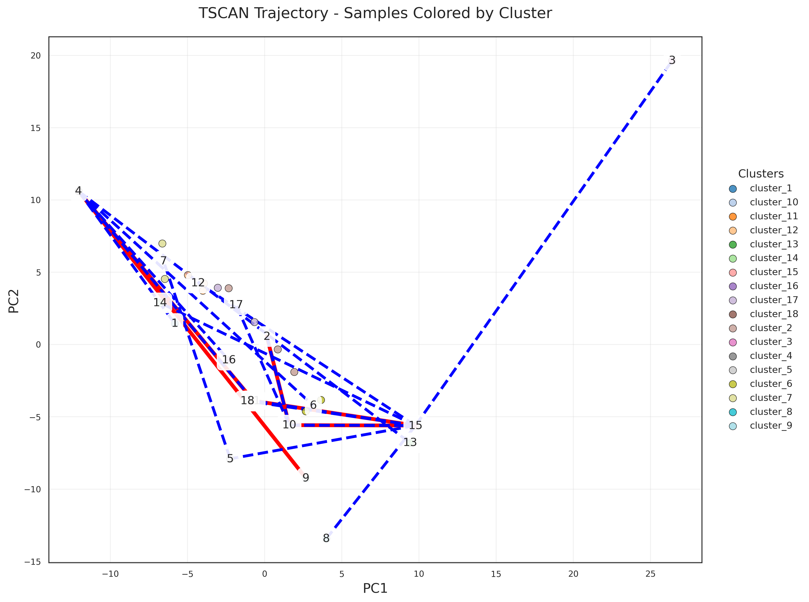
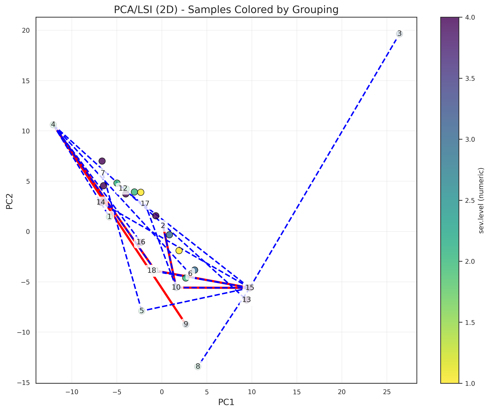
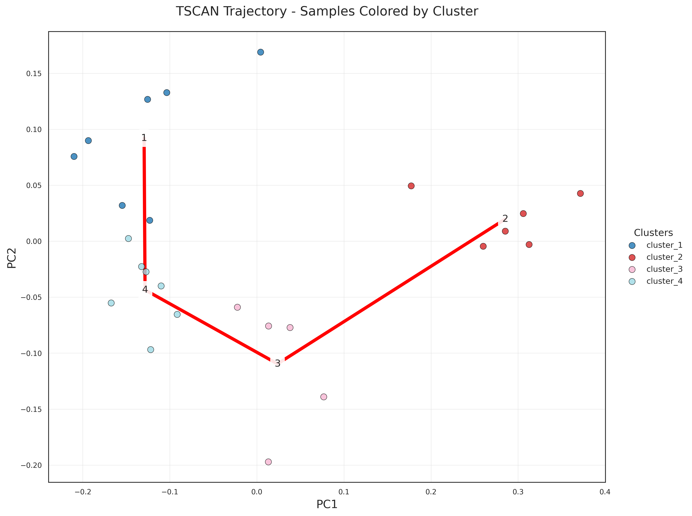
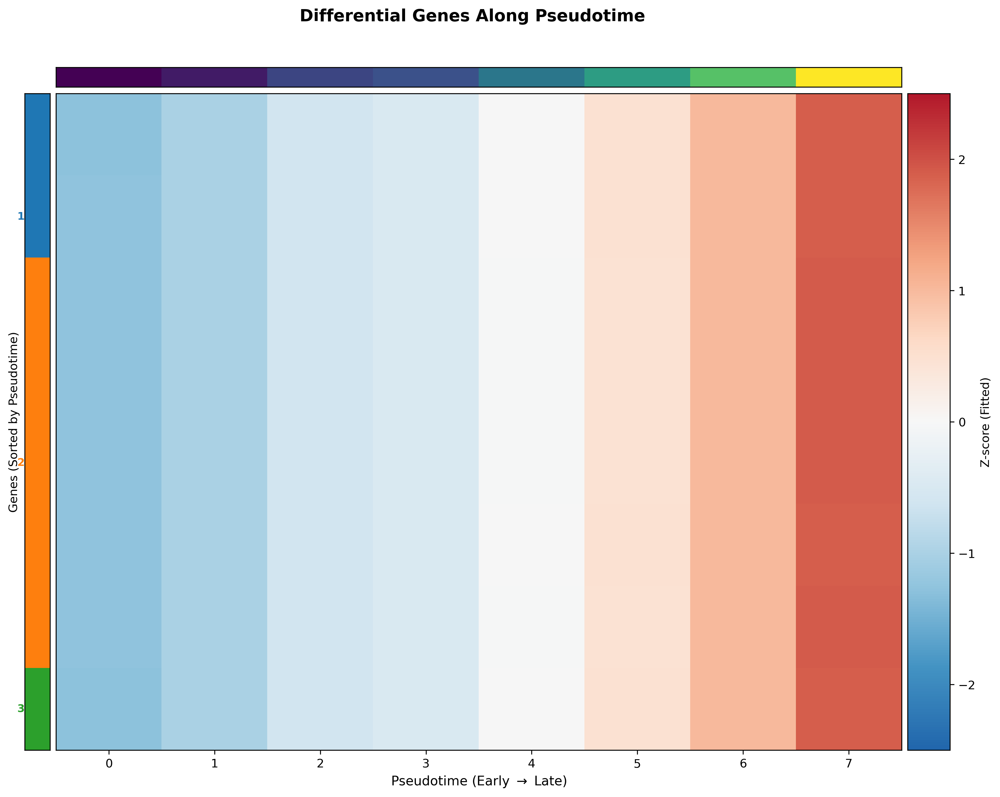

# RNA Pipeline Tutorial

This tutorial follows the RNA branch of `wrapper(...)` and shows key outputs after each stage.

## Run command

```bash
python /users/hjiang/GenoDistance/code/SampleDisc.py -m complex \
  --config /users/hjiang/GenoDistance/code/config/config_covid_rna.yaml
```

## 1) Preprocessing

Controlled by:

- `rna_preprocessing`
- `rna_min_cells`, `rna_min_genes`, `rna_pct_mito_cutoff`
- `rna_num_cell_hvgs`, `rna_cell_embedding_num_pcs`
- `rna_cell_level_batch_key`

Main API: `preprocess()` / `preprocess_linux()`

## 2) Cell type clustering

Controlled by:

- `rna_cell_type_cluster`
- `rna_leiden_cluster_resolution`
- `rna_existing_cell_types`
- `rna_n_target_cell_clusters`
- `rna_umap`

Main API: `cell_types()`


## 3) Sample embedding

Controlled by:

- `rna_derive_sample_embedding`
- `rna_sample_hvg_number`
- `rna_sample_embedding_dimension`
- `rna_harmony_for_proportion`

Main API: `calculate_sample_embedding()`

## 4) Sample distance

Controlled by:

- `rna_sample_distance_calculation`
- `rna_sample_distance_methods`
- `rna_grouping_columns`

Main API: `sample_distance()`


## 5) Trajectory analysis

Controlled by:

- `rna_trajectory_analysis`
- `rna_trajectory_supervised`
- `rna_n_cca_pcs`
- `rna_trajectory_col`
- `rna_cca_pvalue`

Main API: `CCA_Call()`, `cca_pvalue_test()`, `TSCAN()`






## 6) Trajectory DGE

Controlled by:

- `rna_trajectory_dge`
- `rna_fdr_threshold`, `rna_effect_size_threshold`
- `rna_top_n_genes`, `rna_num_splines`, `rna_spline_order`
- `rna_visualization_gene_list`

Main API: `run_trajectory_gam_differential_gene_analysis()`




## 7) Sample clustering

Controlled by:

- `rna_sample_cluster`
- `rna_cluster_number`

Main API: `cluster()`


## 8) Additional downstream modules

For proportion testing, RAISIN-based cluster DGE, and extended trajectory visualizations, see [Downstream Analysis](tutorial_downstream.md).

